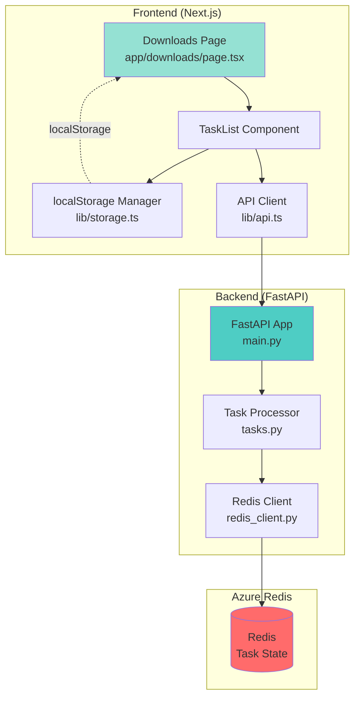
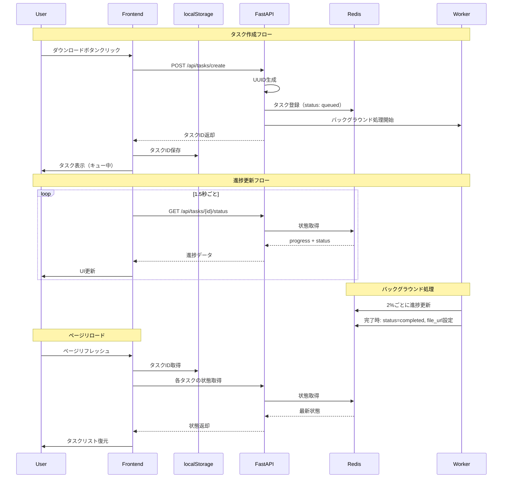

# 設計書

## 概要

Next.js、FastAPI、Azure Redisを組み合わせた非同期ダウンロード処理システム。フロントエンドからタスクを開始し、バックエンドで非同期処理を実行、Redisで状態を管理し、ページ遷移後も進捗を継続表示する学習用サンプル実装。

## ステアリングドキュメントとの整合性

### 技術基準（tech.md）
- Next.js 15以上（15.1推奨）App Routerパターンを採用
- TypeScript 5.0以上完全型付け
- FastAPI最新バージョン（Python 3.11+）
- Azure Redisをクラウドサービスとして利用
- React 19（Next.js 15のデフォルト）

### プロジェクト構造（structure.md）
```
05.tips/01.非同期処理/
├── frontend/                 # Next.jsフロントエンド
│   ├── app/
│   │   ├── downloads/
│   │   │   └── page.tsx     # メインダウンロード管理画面
│   │   ├── login/
│   │   │   └── page.tsx     # APIキー入力画面
│   │   ├── layout.tsx
│   │   └── page.tsx
│   ├── components/
│   │   ├── TaskList.tsx     # タスクリストコンポーネント
│   │   ├── TaskItem.tsx     # 個別タスクコンポーネント
│   │   └── ProgressBar.tsx  # プログレスバー
│   ├── lib/
│   │   ├── api.ts           # APIクライアント（認証ヘッダー付与）
│   │   └── auth.ts          # 認証・APIキー管理
│   ├── types/
│   │   └── task.ts          # 型定義
│   ├── package.json
│   ├── tsconfig.json
│   └── .env.local
│
├── backend/                  # FastAPIバックエンド
│   ├── app/
│   │   ├── main.py          # FastAPIアプリケーション
│   │   ├── models.py        # Pydanticモデル
│   │   ├── auth.py          # 認証ミドルウェア
│   │   ├── redis_client.py  # Redis接続管理
│   │   ├── tasks.py         # タスク処理ロジック
│   │   └── utils.py         # ユーティリティ関数
│   ├── requirements.txt
│   └── .env
│
└── README.md                 # セットアップガイド
```

## コード再利用分析

### 既存コードの活用

**01.auth/01.auth0-sample より:**
- `app/layout.tsx`: Next.js App Routerの基本レイアウトパターン
- Tailwind CSS設定

**01.auth/02.auth0_fastapi_sample より:**
- `main.py`: FastAPIの基本セットアップ（CORS、ミドルウェア）
- `.env`管理パターン

**02.CI/01.ci-github-acr-webapp より:**
- Dockerfileパターン（将来的なコンテナ化用）
- 環境変数管理のベストプラクティス

### 新規作成が必要なコンポーネント
- Redis接続クライアント（`redis_client.py`）
- タスク管理UI（`TaskList.tsx`, `TaskItem.tsx`）
- バックグラウンド処理ワーカー（`tasks.py`）
- localStorage永続化ロジック（`storage.ts`）

## アーキテクチャ

### システム全体図



### データフロー図



## コンポーネントとインターフェース

### コンポーネント1: Frontend - Downloads Page

**目的:** ダウンロードタスクの管理画面

**ファイル:** `frontend/app/downloads/page.tsx`

**主要機能:**
- タスク作成ボタン
- タスクリスト表示
- ステータスフィルタリング
- localStorage復元ロジック

**依存関係:**
- `TaskList.tsx`: タスク一覧表示
- `lib/api.ts`: APIクライアント
- `lib/storage.ts`: localStorage管理

**既存パターンの活用:**
- `01.auth/01.auth0-sample/src/app/dashboard/page.tsx` の基本構造
- 認証フローは簡略化（APIキーのみ）

### コンポーネント2: Frontend - TaskList Component

**目的:** タスク一覧の表示とポーリング管理

**ファイル:** `frontend/components/TaskList.tsx`

**主要機能:**
- タスクリスト描画
- 1.5秒ポーリング
- ソート・フィルタリング

**依存関係:**
- `TaskItem.tsx`: 個別タスク表示
- `lib/api.ts`: APIクライアント

**State管理:**
```typescript
interface TaskListState {
  tasks: Task[];
  filter: 'all' | 'processing' | 'completed' | 'failed';
  sortOrder: 'asc' | 'desc';
}
```

### コンポーネント3: Frontend - Auth & Storage Manager

**目的:** 認証とAPIキー管理

**ファイル:** `frontend/lib/auth.ts`

**主要関数:**
```typescript
// APIキー保存
setApiKey(apiKey: string): void

// APIキー取得
getApiKey(): string | null

// APIキー削除（ログアウト）
clearApiKey(): void

// 認証済みかチェック
isAuthenticated(): boolean
```

**認証フロー:**
- 初回アクセス時にAPIキー入力画面を表示
- APIキーをlocalStorageに保存
- すべてのAPIリクエストにX-API-Keyヘッダーとして付与
- 開発用固定キー: "dev-key-user1", "dev-key-user2"

### コンポーネント4: Backend - FastAPI Application

**目的:** RESTful API提供とバックグラウンド処理管理

**ファイル:** `backend/app/main.py`

**エンドポイント:**
```python
POST   /api/tasks/create           # タスク作成（認証必須、10タスク制限チェック）
GET    /api/tasks/my-tasks         # 認証ユーザーのすべてのタスク取得
GET    /api/tasks/{task_id}/status # 単一タスクの進捗取得（認証必須、所有者チェック）
POST   /api/tasks/{task_id}/cancel # タスクキャンセル（認証必須、所有者チェック）
GET    /api/files/{task_id}        # ファイルダウンロード（認証必須、所有者チェック）
```

**認証とレート制限:**
- すべてのエンドポイントでX-API-Keyヘッダーを検証
- APIキーから user_id を取得（簡易マッピング: {"dev-key-user1": "user1", "dev-key-user2": "user2"}）
- 無効なAPIキーの場合は HTTP 401 返却
- APIキー単位で1分間に10タスク作成まで（slowapi使用）
- ユーザーごとのアクティブタスク数（processing/queued）が10個に達した場合は HTTP 429 返却
- `count_user_active_tasks(user_id)` メソッドでユーザーのアクティブタスクをカウント

**依存関係:**
- `redis_client.py`: Redis接続
- `tasks.py`: タスク処理
- `models.py`: Pydanticモデル
- `auth.py`: 認証ミドルウェア

**既存パターンの活用:**
- `01.auth/02.auth0_fastapi_sample/main.py` のCORS設定
- `01.auth/02.auth0_fastapi_sample/dependencies/security.py` の認証パターン（簡略化）
- `02.CI/01.ci-github-acr-webapp/app.py` のエラーハンドリング

### コンポーネント5: Backend - Redis Client

**目的:** Azure Redis接続とタスク状態管理

**ファイル:** `backend/app/redis_client.py`

**主要機能:**
```python
class RedisClient:
    def __init__(self, connection_string: str)
    def connect(self) -> None  # 接続確立
    def set_task(self, task_id: str, user_id: str, data: dict, ttl: int = 86400) -> None
    def get_task(self, task_id: str) -> Optional[dict]
    def get_user_tasks(self, user_id: str) -> List[dict]  # ユーザーのすべてのタスク取得
    def update_progress(self, task_id: str, progress: int) -> None
    def update_status(self, task_id: str, status: str) -> None
    def count_user_active_tasks(self, user_id: str) -> int  # ユーザーのアクティブタスク数
    def delete_task(self, task_id: str) -> None
```

**データ構造:**
- タスクキー: `task:{task_id}` - タスク詳細（user_id含む）
- ユーザーインデックス: `user:{user_id}:tasks` (Set型) - ユーザーのタスクID一覧

**接続管理:**
- 接続プール使用（max_connections=50）
- 自動リトライ（指数バックオフ: 1秒、2秒、4秒）
- SSL接続（Azure Redis要件）

### コンポーネント6: Backend - Task Processor

**目的:** 非同期ダウンロード処理のシミュレーション

**ファイル:** `backend/app/tasks.py`

**主要機能:**
```python
async def process_download_task(task_id: str, redis_client: RedisClient):
    """
    非同期ダウンロード処理
    - 0%から100%まで2%刻みで進捗更新
    - 各ステップで0.5秒sleep（シミュレーション）
    - 完了時にテキストファイル生成
    - エラー時はRedisにエラー詳細保存
    """
    pass
```

**バックグラウンド実行:**
- FastAPIの`BackgroundTasks`を使用
- キャンセル検知機能（10秒ごとにRedisステータスチェック）
- タスクタイムアウト：30分（1800秒）で自動タイムアウト
- 開始時刻をRedisに保存し、各ステップで経過時間を確認

**ファイルストレージ:**
- ローカルファイルシステム: `/tmp/downloads/{task_id}/result.txt`
- ファイルクリーンアップ: 24時間後に自動削除（別途バックグラウンドジョブ）
- 本番環境ではAzure Blob Storageへの移行を推奨

## データモデル

### Task Model (Pydantic)

```python
from pydantic import BaseModel, Field
from typing import Optional, Literal
from datetime import datetime

class Task(BaseModel):
    task_id: str = Field(..., description="UUID v4形式のタスクID")
    user_id: str = Field(..., description="タスク所有者のユーザーID")
    status: Literal["queued", "processing", "completed", "failed", "cancelled"]
    progress: int = Field(0, ge=0, le=100, description="進捗率（0-100%）")
    created_at: datetime
    updated_at: datetime
    file_url: Optional[str] = None  # 完了時のダウンロードURL
    error: Optional[dict] = None    # エラー詳細

    class Config:
        json_schema_extra = {
            "example": {
                "task_id": "550e8400-e29b-41d4-a716-446655440000",
                "user_id": "user1",
                "status": "processing",
                "progress": 45,
                "created_at": "2025-10-12T10:30:00Z",
                "updated_at": "2025-10-12T10:32:15Z",
                "file_url": None,
                "error": None
            }
        }
```

### Task Model (TypeScript)

```typescript
export interface Task {
  task_id: string;
  user_id: string;
  status: 'queued' | 'processing' | 'completed' | 'failed' | 'cancelled';
  progress: number;  // 0-100
  created_at: string;  // ISO 8601
  updated_at: string;  // ISO 8601
  file_url?: string;
  error?: {
    type: string;
    message: string;
    timestamp: string;
  };
}

export interface CreateTaskResponse {
  task_id: string;
  status: string;
}

export interface TaskStatusResponse {
  task: Task;
}
```

### Redis データ構造

**Key:** `task:{task_id}`

**Value (JSON):**
```json
{
  "task_id": "550e8400-e29b-41d4-a716-446655440000",
  "user_id": "user1",
  "status": "processing",
  "progress": 45,
  "created_at": "2025-10-12T10:30:00Z",
  "updated_at": "2025-10-12T10:32:15Z",
  "file_url": null,
  "error": null
}
```

**Key:** `user:{user_id}:tasks` (Set型)
**Value:** タスクIDのセット
```
["550e8400-e29b-41d4-a716-446655440000", "660e9500-f30c-52e5-b827-557766551111"]
```

**TTL:** 86400秒（24時間）

## エラーハンドリング

### エラーシナリオ1: Redis接続失敗

**ハンドリング:**
- 指数バックオフでリトライ（1秒、2秒、4秒）
- 3回失敗後にHTTP 503返却
- フロントエンドに「サービスが一時的に利用できません」表示

**ユーザー影響:**
- タスク作成/進捗取得不可
- エラーメッセージ表示

### エラーシナリオ2: ネットワーク切断（フロントエンド）

**ハンドリング:**
- ポーリング失敗時にオフラインインジケーター表示
- 指数バックオフで自動リトライ
- 接続復旧時に通常ポーリング再開

**ユーザー影響:**
- 一時的な進捗更新停止
- オフライン表示

### エラーシナリオ3: タスク処理失敗

**ハンドリング:**
- try-catchでエラー捕捉
- Redisに詳細保存（type, message, stack_trace, timestamp）
- ステータスを"failed"に更新
- フロントエンドに具体的エラーメッセージ表示

**ユーザー影響:**
- 該当タスクが失敗状態
- 他タスクは継続

### エラーシナリオ4: localStorage/Redis不整合

**ハンドリング:**
- ページロード時に全タスクIDをRedis検証
- Redisに存在しないタスクはlocalStorageから削除
- ユーザーに通知なし（自動クリーンアップ）

**ユーザー影響:**
- 期限切れタスクが自動削除

## テスト戦略

### ユニットテスト

**バックエンド（pytest）:**
- `test_redis_client.py`: Redis接続、CRUD操作
- `test_tasks.py`: タスク処理ロジック、進捗更新
- `test_main.py`: APIエンドポイントレスポンス

**フロントエンド（Jest）:**
- `storage.test.ts`: localStorage操作
- `api.test.ts`: APIクライアント（mock）
- `TaskList.test.tsx`: コンポーネントロジック

### 統合テスト

**シナリオ:**
1. タスク作成 → 進捗更新 → 完了フロー
2. 複数タスク同時実行
3. ページリロード後の復元
4. Redis接続失敗時のリトライ

**ツール:**
- Playwright（E2Eテスト）
- Redis Mock（テスト環境）

### E2Eテスト

**ユーザーシナリオ:**
1. ダウンロード開始 → 進捗監視 → ファイルダウンロード
2. 複数タスク開始 → ページ遷移 → 復元確認
3. タスクキャンセル → ステータス確認

## 実装順序

### Phase 1: バックエンド基盤（要件1）
1. FastAPIプロジェクトセットアップ
2. Redis Clientクラス実装
3. Task Pydanticモデル定義
4. POST /api/tasks/create エンドポイント

### Phase 2: タスク処理（要件2）
5. バックグラウンド処理関数実装
6. 進捗更新ロジック
7. GET /api/tasks/{id}/status エンドポイント

### Phase 3: フロントエンド基本（要件1, 2）
8. Next.jsプロジェクトセットアップ
9. 型定義（types/task.ts）
10. APIクライアント（lib/api.ts）
11. Downloads Page基本構造
12. TaskListコンポーネント
13. ProgressBarコンポーネント

### Phase 4: 永続化（要件3）
14. localStorage Manager実装
15. ページロード時の復元ロジック
16. Redis/localStorage同期処理

### Phase 5: 追加機能（要件4, 5, 6）
17. 複数タスク管理
18. ファイルダウンロードエンドポイント
19. タスクキャンセル機能

### Phase 6: エラーハンドリングと polish
20. 包括的エラーハンドリング
21. リトライロジック
22. UIpolish（ステータス色分け、アクセシビリティ）

## セキュリティ考慮事項

### 入力検証
- タスクID: UUID v4形式検証（正規表現）
- ファイルパス: パストラバーサル攻撃防止

### レート制限
- タスク作成: 1分間に10リクエスト/ユーザー
- 実装: `slowapi`ライブラリ使用

### CORS設定
- 開発: `http://localhost:3000`
- 本番: 環境変数で許可オリジン指定

### ファイルアクセス
- 一時URL（署名付き、有効期限1時間）
- または認証ヘッダー検証

## パフォーマンス最適化

### フロントエンド
- ポーリング最適化: タスク完了/失敗時にポーリング停止
- React.memo使用: TaskItemコンポーネント
- useSWR検討: キャッシュとリフェッチ管理

### バックエンド
- Redis接続プール: 最大50接続
- 非同期I/O: async/await全面採用
- レスポンスキャッシュ: 変更なしの場合304返却

### Redis
- Pipeline使用: 複数タスク状態取得時
- 適切なTTL: メモリ効率化

## 環境変数設定

### バックエンド（.env）
```bash
# Redis接続
REDIS_URL=rediss://your-azure-redis.redis.cache.windows.net:6380?ssl_cert_reqs=required

# 認証（開発用固定キー）
API_KEYS=dev-key-user1:user1,dev-key-user2:user2

# CORS設定
CORS_ORIGINS=http://localhost:3000,http://localhost:3001

# レート制限
RATE_LIMIT_PER_MINUTE=10

# ファイルストレージ
FILE_STORAGE_PATH=/tmp/downloads
FILE_CLEANUP_HOURS=24

# タスク設定
MAX_CONCURRENT_TASKS=10
TASK_TIMEOUT_SECONDS=1800
```

### フロントエンド（.env.local）
```bash
# API URL
NEXT_PUBLIC_API_URL=http://localhost:8000

# ポーリング設定
NEXT_PUBLIC_POLL_INTERVAL_MS=1500

# 開発用デフォルトAPIキー（オプション）
NEXT_PUBLIC_DEFAULT_API_KEY=dev-key-user1
```
