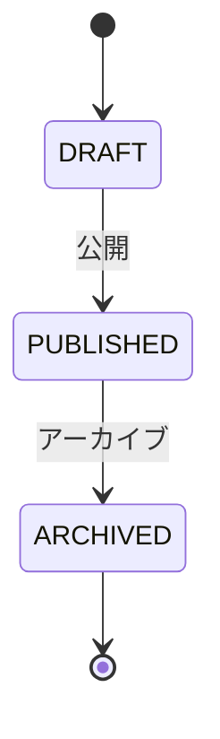
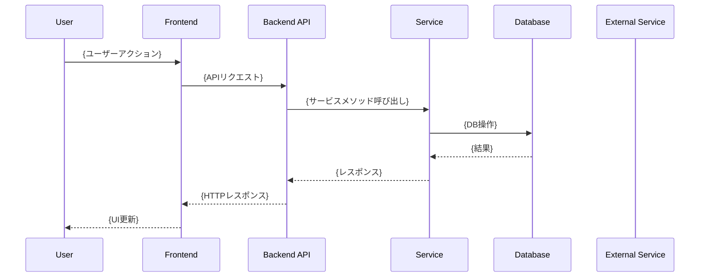

# {Feature Name} 設計書

| 項目 | 内容 |
| --- | --- |
| **Status** | Draft / Review / Implementation / Merged |
| **Owner** | {Name} |
| **Ticket** | #{Issue Number} |
| **Spec Path** | `docs/specs/{feature-name}/` |
| **Last Updated** | YYYY-MM-DD |

> **AIアシスタントへの指示**:
> このドキュメントは「仕様駆動開発」のマスタードキュメントです。
> 各セクションは実装後に `/wrap-up` コマンドで `docs/` 以下の永続ドキュメントへ自動昇格されます。
> **整合性を重視**して記述してください。

> 📋 **参照ドキュメント**:
>
> - **バリデーションルール**: [docs/development/validation-rules.md](../../docs/development/validation-rules.md) - 入力検証ルール
> - **テスト基準**: [docs/development/testing-standards.md](../../docs/development/testing-standards.md) - テストケース作成ルール
> - **コーディング規約**: [docs/development/coding-standards-index.md](../../docs/development/coding-standards-index.md) - 命名規則
> - **セキュリティ**: [docs/security/README.md](../../docs/security/README.md) - セキュリティ実装ガイドライン
> - **サービス層設計**: [docs/design/service_layer_design.md](../../docs/design/service_layer_design.md) - 実装パターン

---

## 1. 概要 (Overview)
**昇格先**: `docs/functional_requirements.md` に機能エントリ追加

### 1.1 機能概要
<!-- この機能が解決する課題とゴールを簡潔に記述 -->

### 1.2 ユーザーストーリー
<!-- As a [role], I want [feature], so that [benefit] 形式で記述 -->
- [ ] {Role}は{Feature}できる。これにより{Benefit}。

### 1.3 受け入れ条件 (Acceptance Criteria)
<!-- EARS形式: WHEN [trigger], IF [condition], THEN [result] -->
1. WHEN ユーザーが{action}する, THEN {result}となる
2. IF {condition}, THEN {error handling}

### 1.4 既存機能との関係
**参照**: `docs/functional_requirements.md`
- 関連機能: F-XXX ({機能名})
- 影響範囲: {影響を受ける既存機能}

---

## 2. API設計 (Backend)
**昇格先**: `docs/api/{feature}_apis.md` (新規作成)

### 2.1 エンドポイント一覧
| Method | Path | Summary | Auth | 昇格対象 |
|--------|------|---------|------|---------|
| POST | `/api/v1/{resource}` | {概要} | Required | Yes |
| GET | `/api/v1/{resource}/{id}` | {概要} | Required | Yes |

### 2.2 詳細仕様

#### `POST /api/v1/{resource}`

**Description**: {エンドポイントの説明}

**Request Body** (Pydantic Model):
```python
class CreateResourceRequest(BaseModel):
    """リソース作成リクエスト"""
    field1: str = Field(..., description="フィールド1の説明")
    field2: Optional[int] = Field(None, description="フィールド2の説明")

    class Config:
        json_schema_extra = {
            "example": {
                "field1": "example_value",
                "field2": 123
            }
        }
```

**Response** (200 OK):
```python
class CreateResourceResponse(BaseModel):
    """リソース作成レスポンス"""
    id: str = Field(..., description="作成されたリソースID")
    status: str = Field(..., description="ステータス")
    created_at: datetime = Field(..., description="作成日時")
```

```json
{
  "id": "uuid-xxx-xxx",
  "status": "success",
  "created_at": "2025-01-01T00:00:00Z"
}
```

**Error Responses**:
| Status | Error Code | Description |
|--------|------------|-------------|
| 400 | VALIDATION_ERROR | 入力バリデーションエラー |
| 401 | UNAUTHORIZED | 認証エラー |
| 404 | NOT_FOUND | リソース未検出 |
| 500 | INTERNAL_ERROR | サーバーエラー |

---

## 3. データモデル・バリデーション
**昇格先**: `docs/api/{feature}_apis.md` に含める

### 3.1 リクエストパラメータ詳細

| 項目名 | 型 | 必須 | 制約ルール | 備考 |
|--------|-----|------|-----------|------|
| field1 | string | ✅ | 1〜100文字 | 空文字不可 |
| field2 | integer | - | 0以上 | 未設定時はnull |
| email | string | ✅ | Email形式 | 重複不可（DBユニーク） |
| format | string | ✅ | Enum: csv, excel | 大文字小文字区別なし |

### 3.2 レスポンスモデル

```python
class ResourceResponse(BaseModel):
    """リソースレスポンス"""
    id: str
    field1: str
    field2: Optional[int]
    created_at: datetime
    updated_at: datetime
```

---

## 4. ロジック・権限設計
**昇格先**: `docs/design/service_layer_design.md` に追記

### 4.1 認証・認可

* **認証**: 必須 (Bearer Token / Auth0)
* **認可 (Role)**: `Manager` 以上

### 4.2 リソースアクセス制御

| 操作 | 権限ルール |
|------|-----------|
| 閲覧 | 自分の所属部署のデータのみ (`where department_id = user.department_id`) |
| 編集 | 作成者本人のみ |
| 削除 | Admin のみ |

### 4.3 ビジネスロジック

```python
class ResourceService:
    """
    {Service説明}

    Attributes:
        db: データベースセッション
        blob_service: Azure Blob Storage サービス

    参照パターン: docs/design/service_layer_design.md Section 3.2
    """

    def __init__(self, db: Session, blob_service: BlobService):
        self.db = db
        self.blob_service = blob_service

    async def create_resource(self, request: CreateResourceRequest, current_user: User) -> ResourceResponse:
        """
        リソース作成

        Args:
            request: 作成リクエスト
            current_user: 実行ユーザー

        Returns:
            ResourceResponse: 作成されたリソース

        Raises:
            ValidationError: バリデーションエラー
            PermissionError: 権限エラー
        """
        # 1. 権限チェック
        # 2. バリデーション
        # 3. DB保存
        pass
```

### 4.4 処理フロー
1. リクエストバリデーション
2. 認証・認可チェック
3. ビジネスロジック実行
4. データベース操作
5. レスポンス生成

---

## 5. データベース設計
**昇格先**: `docs/database/schema/{table_name}.md` (新規作成)

### 5.1 新規テーブル

```sql
-- テーブル: {table_name}
-- 説明: {テーブルの説明}
CREATE TABLE {table_name} (
    id VARCHAR(36) PRIMARY KEY COMMENT 'UUID形式の主キー',
    {column_name} {DATA_TYPE} {CONSTRAINTS} COMMENT '{説明}',
    status ENUM('active', 'inactive', 'deleted') NOT NULL DEFAULT 'active' COMMENT 'ステータス',
    created_at TIMESTAMP DEFAULT CURRENT_TIMESTAMP COMMENT '作成日時',
    updated_at TIMESTAMP DEFAULT CURRENT_TIMESTAMP ON UPDATE CURRENT_TIMESTAMP COMMENT '更新日時',

    -- 外部キー
    FOREIGN KEY ({fk_column}) REFERENCES {ref_table}({ref_column}),

    -- インデックス
    INDEX idx_{table_name}_{column} ({column_name})
) ENGINE=InnoDB DEFAULT CHARSET=utf8mb4 COLLATE=utf8mb4_unicode_ci;
```

### 5.2 既存テーブル変更
<!-- 変更がない場合は「なし」と記載 -->
なし

### 5.3 ER図 (該当部分)
```mermaid
erDiagram
    {table_name} {
        string id PK
        string field1
        int field2
        datetime created_at
    }
    {table_name} ||--o{ related_table : "has"
```

### 5.4 マイグレーション
**Alembic Revision**: `{revision_id}` (実装後に記入)

---

## 6. 状態遷移
**昇格先**: `docs/design/` 配下に追記（該当する場合のみ）

### 6.1 ステータス定義 (Enum)

| 値 (Code) | 日本語名 | 説明 |
|-----------|---------|------|
| `DRAFT` | 下書き | 初期状態。編集可能。 |
| `PUBLISHED` | 公開中 | 一般ユーザー閲覧可。 |
| `ARCHIVED` | アーカイブ | 閲覧不可。論理削除扱い。 |

### 6.2 遷移ルール

| From | To | 可否 | 条件 |
|------|-----|------|------|
| DRAFT | PUBLISHED | ✅ | 必須項目入力済み |
| PUBLISHED | ARCHIVED | ✅ | Admin権限 |
| ARCHIVED | DRAFT | ❌ | 復元不可 |

### 6.3 状態遷移図


---

## 7. フロントエンド設計
**昇格先**: `docs/design/detailed_design/frontend/component_design.md` に追記

### 7.1 コンポーネント構成

#### {ComponentName}
**パス**: `frontend/src/app/components/domains/{domain}/{ComponentName}.tsx`

```typescript
interface {ComponentName}Props {
  /** プロパティ1の説明 */
  prop1: string;
  /** プロパティ2の説明 */
  prop2?: number;
  /** コールバック関数 */
  onSuccess?: (result: ResultType) => void;
  onError?: (error: Error) => void;
}
```

**状態管理**:
- `isLoading`: 処理中フラグ
- `error`: エラー状態
- `data`: 取得データ

**使用フック**:
- `useQuery` / `useMutation` (React Query)
- `useState` / `useEffect` (React)

### 7.2 画面遷移
**参照**: `docs/design/basic_design/screen_transition.drawio`

```mermaid
graph LR
    A[{画面A}] --> B[{画面B}]
    B --> C[{画面C}]
```

### 7.3 API呼び出し
**パス**: `frontend/src/app/api/{feature}/route.ts`

```typescript
// Next.js API Route
export async function POST(request: Request) {
  // 実装
}
```

---

## 8. エラーハンドリング
**昇格先**: `docs/design/service_layer_design.md` Section 4 (Exception Handling) に追記

### 8.1 新規例外クラス

```python
class {FeatureName}Error(AppException):
    """
    {機能名}関連エラーの基底クラス

    参照: docs/design/service_layer_design.md Section 4.1
    """
    pass

class {SpecificError}({FeatureName}Error):
    """
    {具体的なエラー説明}
    """
    status_code = 400
    error_code = "{ERROR_CODE}"
    message = "{デフォルトメッセージ}"
```

### 8.2 エラーシナリオ
| シナリオ | 例外クラス | HTTPコード | ユーザー表示 |
|---------|-----------|-----------|------------|
| {シナリオ1} | {Exception1} | 400 | {メッセージ} |
| {シナリオ2} | {Exception2} | 404 | {メッセージ} |
| {シナリオ3} | {Exception3} | 500 | {メッセージ} |

---

## 9. テストケース
**昇格先**: `docs/testing/{category}/` に追記

> **重要**: 「検証すべき副作用」列は**必須項目**です。
> DBの変更、ログ出力、メール送信、外部API呼び出し、ファイル作成など、
> 副作用がある場合は必ず記載してください。副作用がない場合のみ「なし」と記載。

### 9.1 ユースケース & テストシナリオ

| ID | シナリオ概要 | アクター | 前提条件 | 操作手順 / 入力データ | 期待される挙動 / レスポンス | 検証すべき副作用 |
|----|------------|---------|---------|---------------------|---------------------------|-----------------|
| UC-01 | [正常系] リソース作成 | User | 認証済み | 1. フォーム入力<br>2. 送信ボタン押下 | ・200 OK<br>・成功メッセージ表示 | DBにレコード作成 |
| UC-02 | [異常系] 権限なしアクセス | Guest | 未認証 | 1. APIを直接コール | ・401 Unauthorized<br>・ログイン画面へリダイレクト | なし |
| UC-03 | [異常系] バリデーションエラー | User | 認証済み | 1. 不正データ入力<br>2. 送信 | ・400 Bad Request<br>・エラーメッセージ表示 | なし |
| UC-04 | [境界値] 最大文字数 | User | 認証済み | 1. 100文字入力 | ・200 OK | DBに100文字保存 |

### 9.2 テストファイル
- Unit: `backend/tests/unit/test_{feature}_service.py`
- Integration: `backend/tests/integration/test_{feature}_api.py`
- Frontend: `frontend/src/__tests__/{feature}/`

---

## 10. 複雑なフロー詳細 (Optional)
**昇格先**: `docs/design/detailed_design/` 配下（該当する場合のみ）

<!-- 複雑な分岐がある場合の詳細ユースケース記述 -->
<!-- 不要な場合は「該当なし」と記載 -->

該当なし

---

## 11. シーケンス図 (Optional)
**昇格先**: `docs/design/detailed_design/sequence_diagrams/{feature}.md` (新規作成)

<!-- 非同期処理・外部連携時のみ作成 -->
<!-- 不要な場合は「該当なし」と記載 -->



---

## 12. 実装メモ (Implementation Notes)
<!-- 実装中に判明した注意点、決定事項を記録 -->

### 12.1 決定事項
- {日付}: {決定内容}

### 12.2 注意点
- {注意事項}

### 12.3 今後の課題 (Future Work)
- {将来対応が必要な項目}

### 12.4 完了タスク
<!-- /spec-implement で完了したタスクを記録 -->
- [ ] T-01: {タスク名}
- [ ] T-02: {タスク名}

---

## 13. 昇格チェックリスト (Promotion Checklist)

> **Note**: `/wrap-up` コマンド実行時に以下のチェックリストが検証されます。
> 実装完了後、各項目を確認してください。

### 必須項目
- [ ] **機能要件** → `docs/functional_requirements.md`
  - 機能ID: F-{XXX} (自動採番)
  - 機能名: {feature_name}
  - 実装状況: ✅ 実装済み

- [ ] **API仕様** → `docs/api/{feature}_apis.md`
  - エンドポイント数: {N}件
  - フォーマット: 既存API仕様書形式に準拠

- [ ] **API一覧更新** → `docs/api/README.md`
  - エンドポイント総数更新
  - 新規APIへのリンク追加

### 条件付き項目 (該当する場合のみ)
- [ ] **サービス層** → `docs/design/service_layer_design.md`
  - 新規Service: {ServiceName}
  - 追記セクション: Section {X.X}

- [ ] **データベース** → `docs/database/schema/{table}.md`
  - 新規テーブル: {table_name}
  - マイグレーション: {revision_id}

- [ ] **フロントエンド** → `docs/design/detailed_design/frontend/component_design.md`
  - 新規コンポーネント: {ComponentName}

- [ ] **シーケンス図** → `docs/design/detailed_design/sequence_diagrams/`
  - 図表ファイル: {feature}.md

### 検証項目
- [ ] 全テストがパス
- [ ] コードレビュー完了
- [ ] セキュリティチェック完了

---

## 変更履歴

| 日付 | バージョン | 変更内容 | 担当者 |
|------|----------|---------|--------|
| YYYY-MM-DD | 0.1.0 | 初版作成 | {Name} |
| YYYY-MM-DD | 0.2.0 | レビュー反映 | {Name} |
| YYYY-MM-DD | 1.0.0 | 実装完了、昇格準備 | {Name} |
