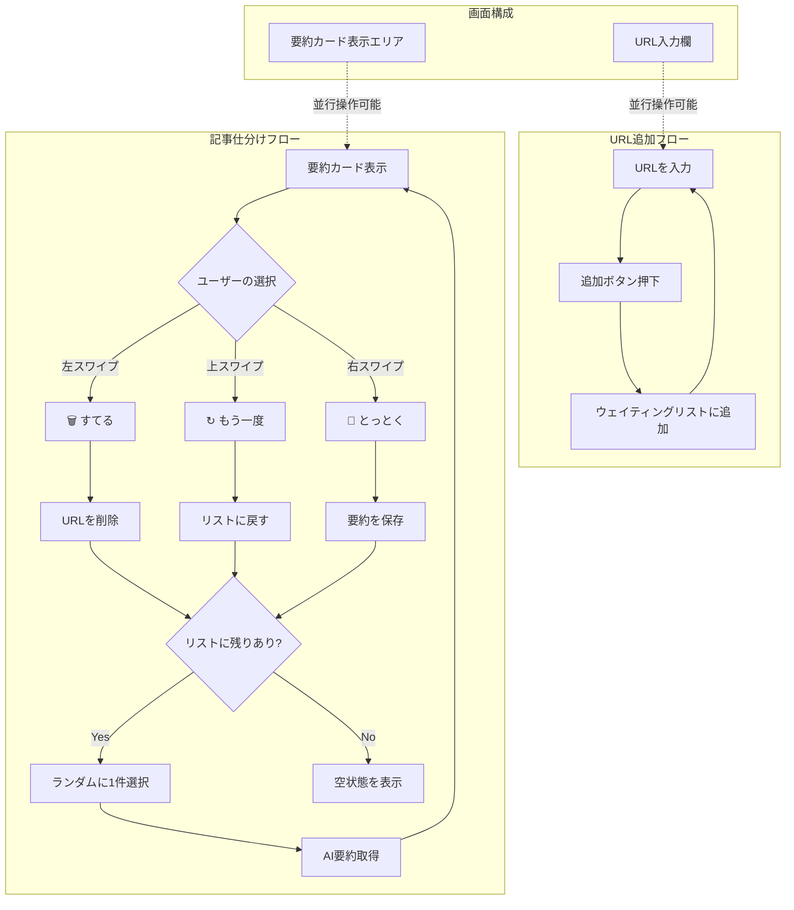
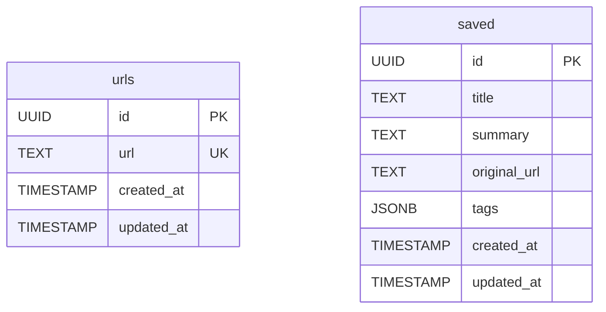

# SwipeSummarize

## 1. プロジェクト概要

### 1.1 アプリ名

**SwipeSummarize** - スワイプで記事を仕分ける AI 要約アプリ

### 1.2 コンセプト

「後で読む」リストに溜まった記事を、AI 要約でサクサク消化。Tinder 風 UI で直感的に「とっとく/すてる」を判断できる Web アプリ。

### 1.3 解決する課題

- ブラウザのタブが増えすぎる問題
- 「後で読む」が永遠に読まれない問題
- 記事を読む時間がない問題

---

## 2. 機能要件

### 2.1 コア機能

| 機能           | 説明                                        | 優先度 |
| -------------- | ------------------------------------------- | ------ |
| URL 登録       | URL を入力してウェイティングリストに追加    | P0     |
| ランダム表示   | ウェイティングリストからランダムに 1 件選択 | P0     |
| AI 要約        | 選択された記事を AI で要約して表示          | P0     |
| 3 択アクション | とっとく / すてる / もう一度                | P0     |
| 保存済みリスト | 「とっとく」した要約の一覧表示              | P0     |

### 2.2 サブ機能

| 機能               | 説明                                | 優先度 |
| ------------------ | ----------------------------------- | ------ |
| タグ付け           | 保存した記事にタグを追加            | P1     |
| 検索               | 保存済み記事の検索                  | P1     |
| エクスポート       | 保存済み記事を Markdown/JSON で出力 | P2     |
| ブックマークレット | ブラウザから 1 クリックで URL 追加  | P2     |
| ユーザー認証       | Supabase Auth でログイン機能        | P2     |

### 2.3 ユーザーフロー



**ポイント:**

- URL 入力と記事の仕分けは**同一画面で並行して操作可能**
- URL はいつでも追加できる
- 要約カードが表示されている間も、新しい URL を追加できる

---

## 3. 技術スタック

### 3.1 フロントエンド

| 技術              | バージョン | 用途                                     |
| ----------------- | ---------- | ---------------------------------------- |
| **Next.js**       | 16.1       | フレームワーク（App Router）             |
| **React**         | 19.2       | UI ライブラリ                            |
| **TypeScript**    | 5.1+       | 型安全性                                 |
| **Tailwind CSS**  | 4.x        | スタイリング                             |
| **shadcn/ui**     | latest     | UI コンポーネント                        |
| **Radix UI**      | latest     | shadcn/ui の基盤（アクセシビリティ対応） |
| **Framer Motion** | 11.x       | スワイプアニメーション                   |

### 3.2 バックエンド

| 技術                   | 用途                                 |
| ---------------------- | ------------------------------------ |
| **Next.js API Routes** | API エンドポイント（Server Actions） |
| **Supabase**           | BaaS（Database + Auth）              |

### 3.3 データベース（Supabase）

| 機能               | 説明                       |
| ------------------ | -------------------------- |
| PostgreSQL         | リレーショナル DB          |
| Row Level Security | 行レベルセキュリティ       |
| Realtime           | リアルタイム更新（将来用） |
| Auth               | 認証機能（将来用）         |

### 3.4 外部 API

| サービス              | 用途                   | 料金                       |
| --------------------- | ---------------------- | -------------------------- |
| **Jina Reader API**   | URL からコンテンツ抽出 | 無料枠: 1000 万トークン    |
| **Google Gemini API** | テキスト要約           | 無料枠: 1500 リクエスト/日 |
| (代替) Claude API     | テキスト要約           | 従量課金                   |

### 3.5 インフラ

| サービス     | 用途         | 料金             |
| ------------ | ------------ | ---------------- |
| **Vercel**   | ホスティング | 無料枠あり       |
| **Supabase** | DB + Auth    | 無料枠: 500MB DB |

---

## 4. API 設計

### 4.1 エンドポイント一覧

#### URLs（ウェイティングリスト）

```
POST   /api/urls           # URL追加
GET    /api/urls           # ウェイティングリスト取得
GET    /api/urls/random    # ランダムに1件取得（要約付き）
DELETE /api/urls/:id       # URL削除（すてる）
```

#### Saved（保存済み）

```
POST   /api/saved          # 要約を保存（とっとく）
GET    /api/saved          # 保存済みリスト取得
GET    /api/saved/:id      # 保存済み詳細取得
DELETE /api/saved/:id      # 保存済み削除
```

### 4.2 API 詳細

#### POST /api/urls

URL をウェイティングリストに追加

**Request:**

```json
{
  "url": "https://example.com/article"
}
```

**Response:**

```json
{
  "id": "uuid-xxx",
  "url": "https://example.com/article",
  "created_at": "2025-12-26T10:00:00Z"
}
```

#### GET /api/urls/random

ランダムに 1 件取得し、AI 要約を生成

**Response:**

```json
{
  "id": "uuid-xxx",
  "url": "https://example.com/article",
  "title": "記事タイトル",
  "summary": "AIによる要約テキスト...",
  "original_length": 5000,
  "created_at": "2025-12-26T10:00:00Z"
}
```

#### POST /api/saved

要約を保存（とっとく）

**Request:**

```json
{
  "url_id": "uuid-xxx",
  "title": "記事タイトル",
  "summary": "AIによる要約テキスト...",
  "original_url": "https://example.com/article",
  "tags": ["tech", "ai"]
}
```

---

## 5. データベース設計（Supabase）

### 5.1 テーブル構成



### 5.2 SQL スキーマ

```sql
-- urls テーブル（ウェイティングリスト）
CREATE TABLE urls (
  id UUID PRIMARY KEY DEFAULT gen_random_uuid(),
  url TEXT NOT NULL UNIQUE,
  created_at TIMESTAMP WITH TIME ZONE DEFAULT NOW(),
  updated_at TIMESTAMP WITH TIME ZONE DEFAULT NOW()
);

-- saved テーブル（保存済み要約）
CREATE TABLE saved (
  id UUID PRIMARY KEY DEFAULT gen_random_uuid(),
  title TEXT NOT NULL,
  summary TEXT NOT NULL,
  original_url TEXT NOT NULL,
  tags JSONB DEFAULT '[]'::jsonb,
  created_at TIMESTAMP WITH TIME ZONE DEFAULT NOW(),
  updated_at TIMESTAMP WITH TIME ZONE DEFAULT NOW()
);

-- updated_at 自動更新トリガー
CREATE OR REPLACE FUNCTION update_updated_at_column()
RETURNS TRIGGER AS $$
BEGIN
  NEW.updated_at = NOW();
  RETURN NEW;
END;
$$ language 'plpgsql';

CREATE TRIGGER update_urls_updated_at
  BEFORE UPDATE ON urls
  FOR EACH ROW
  EXECUTE FUNCTION update_updated_at_column();

CREATE TRIGGER update_saved_updated_at
  BEFORE UPDATE ON saved
  FOR EACH ROW
  EXECUTE FUNCTION update_updated_at_column();

-- インデックス
CREATE INDEX idx_urls_created_at ON urls(created_at DESC);
CREATE INDEX idx_saved_created_at ON saved(created_at DESC);
CREATE INDEX idx_saved_tags ON saved USING GIN(tags);
```

### 5.3 Supabase クライアント設定

```typescript
// lib/supabase/client.ts（ブラウザ用）
import { createBrowserClient } from "@supabase/ssr";

export function createClient() {
  return createBrowserClient(
    process.env.NEXT_PUBLIC_SUPABASE_URL!,
    process.env.NEXT_PUBLIC_SUPABASE_ANON_KEY!
  );
}
```

```typescript
// lib/supabase/server.ts（サーバー用）
import { createServerClient } from "@supabase/ssr";
import { cookies } from "next/headers";

export async function createClient() {
  const cookieStore = await cookies();

  return createServerClient(
    process.env.NEXT_PUBLIC_SUPABASE_URL!,
    process.env.NEXT_PUBLIC_SUPABASE_ANON_KEY!,
    {
      cookies: {
        getAll() {
          return cookieStore.getAll();
        },
        setAll(cookiesToSet) {
          try {
            cookiesToSet.forEach(({ name, value, options }) =>
              cookieStore.set(name, value, options)
            );
          } catch {
            // Server Component からの呼び出し時は無視
          }
        },
      },
    }
  );
}
```

---

## 6. UI/UX 設計

### 6.1 画面構成

```
/                   # ホーム（URL入力 + スワイプ画面）
/saved              # 保存済みリスト
/saved/:id          # 保存済み詳細
```

### 6.2 スワイプ操作

| 操作                   | アクション                             |
| ---------------------- | -------------------------------------- |
| 左スワイプ / 🗑️ ボタン | すてる（URL を削除）                   |
| 上スワイプ / ↻ ボタン  | もう一度（ウェイティングリストに戻す） |
| 右スワイプ / 💾 ボタン | とっとく（要約を保存）                 |

### 6.3 カラーパレット

```css
:root {
  --primary: #6366f1; /* インディゴ - メインカラー */
  --danger: #ef4444; /* レッド - すてる */
  --success: #22c55e; /* グリーン - とっとく */
  --neutral: #64748b; /* スレートグレー - もう一度 */
  --background: #f8fafc; /* ライトグレー - 背景 */
  --card: #ffffff; /* ホワイト - カード */
}
```

### 6.4 shadcn/ui コンポーネント一覧

本アプリで使用する shadcn/ui コンポーネント：

| コンポーネント    | 用途                                           |
| ----------------- | ---------------------------------------------- |
| **Button**        | アクションボタン（とっとく、すてる、もう一度） |
| **Card**          | 要約カード、保存済みリストのアイテム           |
| **Input**         | URL 入力フィールド                             |
| **Badge**         | タグ表示                                       |
| **Dialog**        | 確認ダイアログ                                 |
| **Toast**         | 通知メッセージ（Sonner）                       |
| **Skeleton**      | ローディング表示                               |
| **Dropdown Menu** | メニュー（エクスポート等）                     |
| **Separator**     | 区切り線                                       |
| **Scroll Area**   | スクロール可能エリア                           |

#### インストールコマンド

```bash
# shadcn/ui 初期化
npx shadcn@latest init

# 必要なコンポーネントをインストール
npx shadcn@latest add button card input badge dialog sonner skeleton dropdown-menu separator scroll-area
```

---

## 7. 外部 API 連携詳細

### 7.1 Jina Reader API

**エンドポイント:** `https://r.jina.ai/{url}`

**実装例:**

```typescript
// lib/jina.ts
export async function fetchArticleContent(url: string) {
  const response = await fetch(`https://r.jina.ai/${encodeURIComponent(url)}`, {
    headers: {
      Accept: "application/json",
      ...(process.env.JINA_API_KEY && {
        Authorization: `Bearer ${process.env.JINA_API_KEY}`,
      }),
    },
  });

  if (!response.ok) {
    throw new Error(`Jina API error: ${response.status}`);
  }

  const data = await response.json();
  return {
    title: data.title,
    content: data.content,
    url: data.url,
  };
}
```

**レート制限:**

- API キーなし: 20 req/min
- API キーあり: 200 req/min

### 7.2 Gemini API

**インストール:**

```bash
npm install @google/generative-ai
```

**実装例:**

```typescript
// lib/gemini.ts
import { GoogleGenerativeAI } from "@google/generative-ai";

const genAI = new GoogleGenerativeAI(process.env.GEMINI_API_KEY!);

export async function summarizeContent(title: string, content: string) {
  const model = genAI.getGenerativeModel({ model: "gemini-2.0-flash" });

  const prompt = `
以下の記事を日本語で3〜5文に要約してください。
重要なポイントを箇条書きではなく、自然な文章でまとめてください。

タイトル: ${title}

本文:
${content.slice(0, 10000)}  // トークン制限対策
`;

  const result = await model.generateContent(prompt);
  return result.response.text();
}
```

**無料枠:**

- 1 日 1500 リクエスト
- 1 分あたり 15 リクエスト

---

## 8. エラーハンドリング

### 8.1 想定エラーと対処

| エラー                 | 原因                          | 対処                                  |
| ---------------------- | ----------------------------- | ------------------------------------- |
| URL 取得失敗           | Jina API エラー、無効な URL   | ユーザーに通知、リトライ提案          |
| 要約生成失敗           | Gemini API エラー、レート制限 | ユーザーに通知、時間をおいてリトライ  |
| ウェイティングリスト空 | 全記事処理済み                | 「新しい URL を追加してください」表示 |
| DB 接続エラー          | Supabase 接続失敗             | エラー表示、自動リトライ              |

### 8.2 エラーレスポンス形式

```json
{
  "error": {
    "code": "URL_FETCH_FAILED",
    "message": "記事の取得に失敗しました。URLを確認してください。"
  }
}
```

---

## 9. 開発フェーズ

### Phase 1: MVP（1 週間）

- [x] 仕様書作成
- [x] プロジェクトセットアップ（Next.js 16.1）
- [x] Supabase プロジェクト作成・テーブル作成
- [x] URL 追加 API
- [x] ランダム取得 + 要約 API
- [x] API基盤完成（全エンドポイント実装済み）
- [ ] 基本 UI（URL 入力、カード表示、3 ボタン）

### Phase 2: 基本機能完成（1 週間）

- [ ] スワイプアニメーション（Framer Motion）
- [ ] 保存済みリスト画面
- [ ] タグ機能
- [ ] レスポンシブ対応

### Phase 3: 改善・追加機能（1 週間）

- [ ] ブックマークレット
- [ ] 検索機能
- [ ] エクスポート機能
- [ ] Vercel デプロイ

### Phase 4: 拡張（将来）

- [ ] Supabase Auth でユーザー認証
- [ ] マルチユーザー対応
- [ ] PWA 対応

---

## 10. 環境変数

```env
# .env.local

# Supabase
NEXT_PUBLIC_SUPABASE_URL=https://xxxxx.supabase.co
NEXT_PUBLIC_SUPABASE_ANON_KEY=eyJhbGciOiJIUzI1NiIsInR5cCI6IkpXVCJ9...

# Jina Reader API（オプション - 高レート制限用）
JINA_API_KEY=

# Google Gemini API
GEMINI_API_KEY=

# (代替) Anthropic Claude API
# ANTHROPIC_API_KEY=
```

---

## 11. ディレクトリ構成

```
swipe-summarize/
├── app/
│   ├── layout.tsx
│   ├── page.tsx                 # ホーム
│   ├── globals.css              # グローバルスタイル
│   ├── saved/
│   │   ├── page.tsx             # 保存済みリスト
│   │   └── [id]/
│   │       └── page.tsx         # 保存済み詳細
│   └── api/
│       ├── urls/
│       │   ├── route.ts         # POST, GET
│       │   ├── random/
│       │   │   └── route.ts     # GET
│       │   └── [id]/
│       │       └── route.ts     # DELETE
│       └── saved/
│           ├── route.ts         # POST, GET
│           └── [id]/
│               └── route.ts     # GET, DELETE
├── components/
│   ├── ui/                      # shadcn/ui コンポーネント（自動生成）
│   │   ├── button.tsx
│   │   ├── card.tsx
│   │   ├── input.tsx
│   │   ├── badge.tsx
│   │   ├── dialog.tsx
│   │   ├── skeleton.tsx
│   │   ├── dropdown-menu.tsx
│   │   ├── separator.tsx
│   │   └── scroll-area.tsx
│   ├── UrlInput.tsx             # URL入力コンポーネント
│   ├── SummaryCard.tsx          # 要約カードコンポーネント
│   ├── SwipeableCard.tsx        # スワイプ可能カード
│   ├── ActionButtons.tsx        # アクションボタン群
│   ├── SavedList.tsx            # 保存済みリスト
│   └── Header.tsx               # ヘッダー
├── lib/
│   ├── supabase/
│   │   ├── client.ts            # ブラウザ用クライアント
│   │   └── server.ts            # サーバー用クライアント
│   ├── jina.ts                  # Jina API クライアント
│   ├── gemini.ts                # Gemini API クライアント
│   └── utils.ts                 # ユーティリティ（cn関数など）
├── hooks/
│   ├── useUrls.ts               # URL関連のカスタムフック
│   └── useSaved.ts              # 保存済み関連のカスタムフック
├── types/
│   └── index.ts                 # 型定義
├── public/
├── components.json              # shadcn/ui 設定
├── .env.local
├── package.json
├── next.config.ts
├── tailwind.config.ts
└── tsconfig.json
```

---

## 12. パッケージ一覧

```json
{
  "dependencies": {
    "next": "^16.1.0",
    "react": "^19.2.0",
    "react-dom": "^19.2.0",
    "@supabase/supabase-js": "^2.x",
    "@supabase/ssr": "^0.x",
    "@google/generative-ai": "^0.x",
    "framer-motion": "^11.x",

    "// shadcn/ui 関連（npx shadcn add で自動追加）": "",
    "@radix-ui/react-dialog": "^1.x",
    "@radix-ui/react-dropdown-menu": "^2.x",
    "@radix-ui/react-scroll-area": "^1.x",
    "@radix-ui/react-separator": "^1.x",
    "@radix-ui/react-slot": "^1.x",
    "class-variance-authority": "^0.x",
    "clsx": "^2.x",
    "lucide-react": "^0.x",
    "sonner": "^1.x",
    "tailwind-merge": "^2.x"
  },
  "devDependencies": {
    "typescript": "^5.x",
    "@types/node": "^22.x",
    "@types/react": "^19.x",
    "@types/react-dom": "^19.x",
    "tailwindcss": "^4.x",
    "eslint": "^9.x",
    "eslint-config-next": "^16.x"
  }
}
```

> 注: shadcn/ui のコンポーネントは `npx shadcn add` コマンドで追加すると、必要な依存関係も自動的にインストールされます。

---

## 13. セットアップ手順

### 13.1 プロジェクト作成

```bash
# Next.js 16.1 プロジェクト作成
npx create-next-app@latest swipe-summarize --typescript --tailwind --eslint --app --src-dir=false

cd swipe-summarize

# Supabase クライアント
npm install @supabase/supabase-js @supabase/ssr

# Gemini API
npm install @google/generative-ai

# アニメーション
npm install framer-motion
```

### 13.2 shadcn/ui セットアップ

```bash
# shadcn/ui 初期化（対話形式）
npx shadcn@latest init

# 以下の設定を選択:
# - Style: Default
# - Base color: Slate
# - CSS variables: Yes

# 必要なコンポーネントをインストール
npx shadcn@latest add button card input badge dialog sonner skeleton dropdown-menu separator scroll-area
```

**components.json** が生成され、`components/ui/` に各コンポーネントが追加されます。

### 13.3 Supabase セットアップ

1. [Supabase](https://supabase.com) でアカウント作成
2. 新規プロジェクト作成
3. SQL Editor で上記スキーマを実行
4. Project Settings > API から URL と anon key を取得
5. `.env.local` に設定

### 13.4 Gemini API セットアップ

1. [Google AI Studio](https://aistudio.google.com/) で API キー取得
2. `.env.local` に `GEMINI_API_KEY` を設定

---

## 14. 今後の拡張案

- **ユーザー認証**: Supabase Auth でマルチユーザー対応
- **共有機能**: 要約を SNS にシェア
- **Chrome 拡張**: ブラウザから直接 URL 追加
- **PWA 対応**: オフライン対応、ホーム画面追加
- **AI 改善**: 要約スタイルのカスタマイズ（詳細/簡潔）
- **RLS 設定**: ユーザーごとのデータ分離

---

## 付録: 参考リンク

- [Next.js 16.1 ドキュメント](https://nextjs.org/docs)
- [Supabase + Next.js ガイド](https://supabase.com/docs/guides/getting-started/quickstarts/nextjs)
- [shadcn/ui ドキュメント](https://ui.shadcn.com/)
- [Jina Reader API ドキュメント](https://jina.ai/reader/)
- [Google Gemini API ドキュメント](https://ai.google.dev/docs)
- [Framer Motion ドキュメント](https://www.framer.com/motion/)
- [Tailwind CSS v4 ドキュメント](https://tailwindcss.com/docs)
