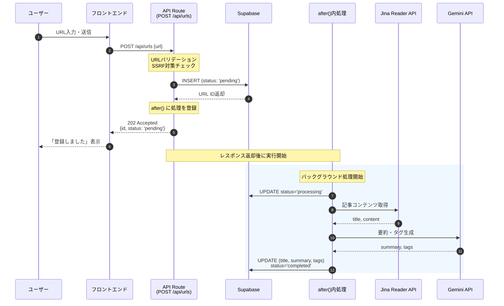
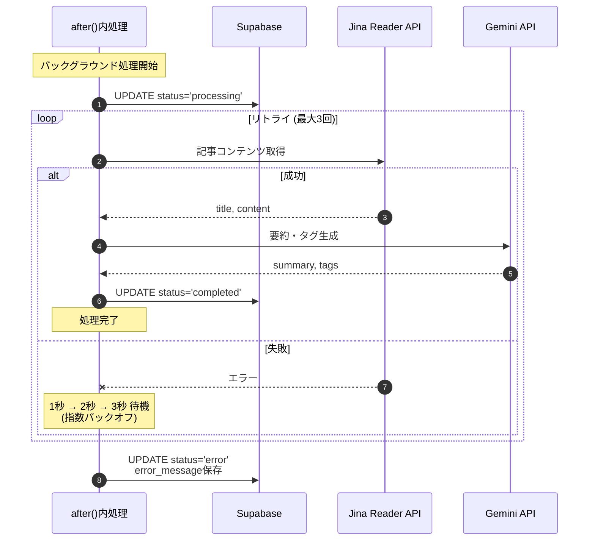
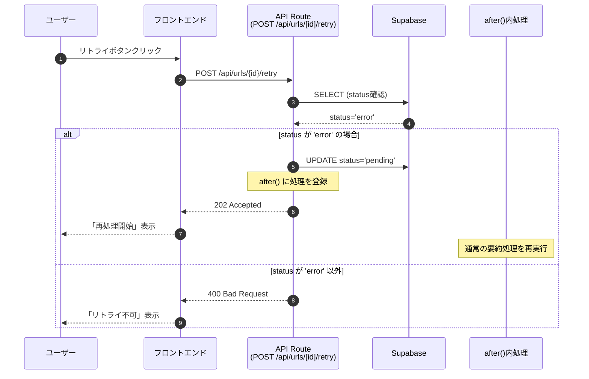
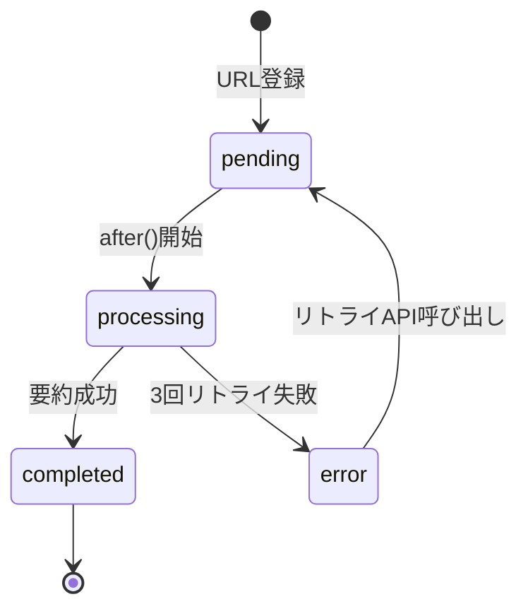

# after() API シーケンス図

## 1. URL登録〜バックグラウンド要約フロー

## 2. エラー発生時のフロー

## 3. リトライAPIフロー

## 4. ステータス遷移図

## 使い方

### Mermaid Live Editorで画像化

1. [Mermaid Live Editor](https://mermaid.live/) にアクセス
2. 上記のコードブロック内容をペースト
3. PNG/SVG でエクスポート
4. note記事に画像として挿入

### VS Code プレビュー

Mermaid対応の拡張機能（例: Markdown Preview Mermaid Support）をインストールすると、VS Code内でプレビュー可能です。
