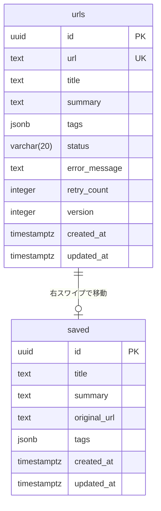

# URLs テーブル スキーマ

**機能ID**: F-007-ASYNC-PROCESS
**最終更新**: 2026-01-04

---

## 概要

URL管理と非同期要約処理のためのテーブル。登録されたURLの要約・タグ生成状態を管理する。

---

## テーブル定義

```sql
CREATE TABLE urls (
  id UUID PRIMARY KEY DEFAULT gen_random_uuid(),
  url TEXT NOT NULL UNIQUE,
  title TEXT,
  summary TEXT,
  tags JSONB DEFAULT '[]'::jsonb,
  status VARCHAR(20) DEFAULT 'pending',
  error_message TEXT,
  retry_count INTEGER DEFAULT 0,
  version INTEGER DEFAULT 1,
  created_at TIMESTAMPTZ DEFAULT now(),
  updated_at TIMESTAMPTZ DEFAULT now(),

  CONSTRAINT chk_urls_status
    CHECK (status IN ('pending', 'processing', 'completed', 'error'))
);

-- インデックス
CREATE INDEX idx_urls_status ON urls(status);
CREATE INDEX idx_urls_status_created ON urls(status, created_at DESC);
```

---

## カラム詳細

| カラム名 | 型 | 必須 | デフォルト | 説明 |
|---------|-----|------|-----------|------|
| id | UUID | ✅ | gen_random_uuid() | 主キー |
| url | TEXT | ✅ | - | URL（ユニーク制約） |
| title | TEXT | - | NULL | 記事タイトル（Jina Reader APIで抽出） |
| summary | TEXT | - | NULL | AI生成要約 |
| tags | JSONB | - | '[]' | AI生成タグ（JSON配列） |
| status | VARCHAR(20) | ✅ | 'pending' | 処理ステータス |
| error_message | TEXT | - | NULL | エラーメッセージ（status='error'時） |
| retry_count | INTEGER | ✅ | 0 | リトライ回数 |
| version | INTEGER | ✅ | 1 | Optimistic Locking用バージョン |
| created_at | TIMESTAMPTZ | ✅ | now() | 作成日時 |
| updated_at | TIMESTAMPTZ | ✅ | now() | 更新日時 |

---

## ステータス値

| 値 | 日本語名 | 説明 |
|-----|---------|------|
| pending | 待機中 | 初期状態。非同期処理開始前 |
| processing | 処理中 | 要約生成中（Jina Reader + LLM API呼び出し中） |
| completed | 完了 | 要約・タグ生成完了。ランダム取得対象 |
| error | エラー | 処理失敗（3回リトライ後）。手動リトライ可能 |

---

## ER図



---

## マイグレーション

```sql
-- File: supabase/migrations/20260103_add_async_processing_columns.sql

-- 新規カラム追加
ALTER TABLE urls
ADD COLUMN IF NOT EXISTS title TEXT,
ADD COLUMN IF NOT EXISTS summary TEXT,
ADD COLUMN IF NOT EXISTS tags JSONB DEFAULT '[]'::jsonb,
ADD COLUMN IF NOT EXISTS status VARCHAR(20) DEFAULT 'pending',
ADD COLUMN IF NOT EXISTS error_message TEXT,
ADD COLUMN IF NOT EXISTS retry_count INTEGER DEFAULT 0,
ADD COLUMN IF NOT EXISTS version INTEGER DEFAULT 1;

-- インデックス作成
CREATE INDEX IF NOT EXISTS idx_urls_status ON urls(status);
CREATE INDEX IF NOT EXISTS idx_urls_status_created ON urls(status, created_at DESC);

-- ステータス制約
ALTER TABLE urls
ADD CONSTRAINT chk_urls_status
CHECK (status IN ('pending', 'processing', 'completed', 'error'));
```

---

## 関連ドキュメント

- [API仕様書](../api/async_process_apis.md)
- [設計書](../specs/async-process/design.md)
- [機能要件](../functional_requirements.md#f-007-async-process-非同期要約処理)
