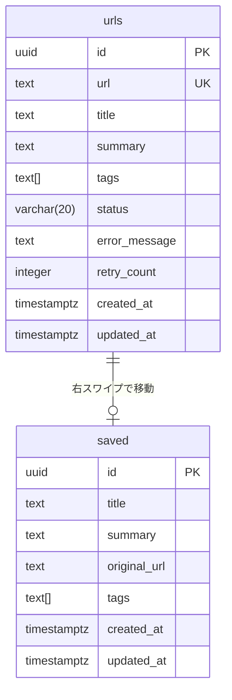
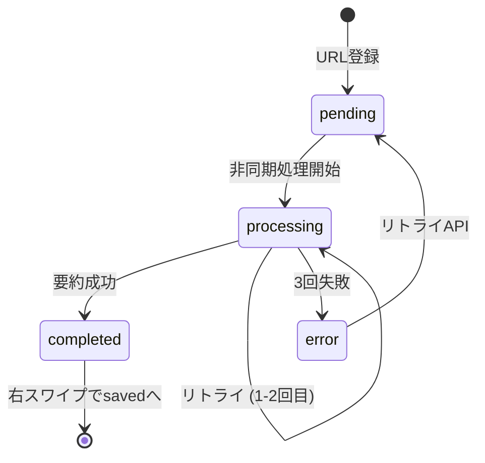
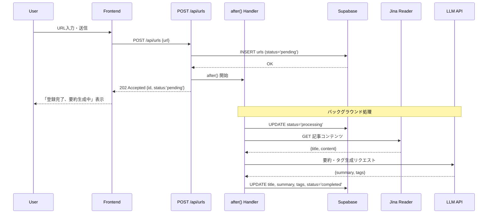
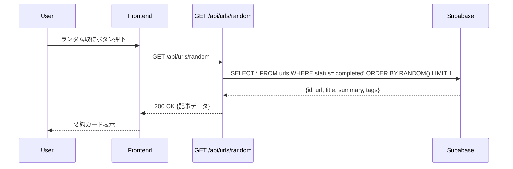

# 非同期要約処理 設計書

| 項目 | 内容 |
| --- | --- |
| **Status** | Draft |
| **Owner** | - |
| **Ticket** | - |
| **Spec Path** | `docs/specs/async-process/` |
| **Last Updated** | 2026-01-03 |

> **AIアシスタントへの指示**:
> このドキュメントは「仕様駆動開発」のマスタードキュメントです。
> 各セクションは実装後に `/wrap-up` コマンドで `docs/` 以下の永続ドキュメントへ自動昇格されます。
> **整合性を重視**して記述してください。

---

## 1. 概要 (Overview)
**昇格先**: `docs/functional_requirements.md` に機能エントリ追加
**機能ID**: F-007-ASYNC-PROCESS

### 1.1 機能概要

URL登録時の要約・タグ生成処理を非同期化し、ユーザー体験を向上させる機能。

**現状の課題**:
- ランダム取得API (`/api/urls/random`) で要約生成を同期実行
- 要約処理に10秒以上かかる場合があり、UX悪化

**解決策**:
- URL登録時に即座にDB保存（同期）
- Next.js 15.1+ の `after()` API を使用して要約・タグ生成をバックグラウンド実行
- Supabaseに要約結果を永続化

### 1.2 ユーザーストーリー

- [x] ユーザーはURLを登録すると、即座にレスポンスを受け取れる。これにより、待ち時間なく次の操作ができる。
- [x] ユーザーはランダム取得時に要約済みの記事のみが表示される。これにより、常に要約付きの記事を閲覧できる。
- [x] ユーザーはWaiting Listで要約処理中のURLを確認できる。これにより、登録したURLの状態を把握できる。

### 1.3 受け入れ条件 (Acceptance Criteria)

1. WHEN ユーザーがURLを登録する, THEN 即座に成功レスポンス（202 Accepted）が返却される
2. WHEN URL登録後, THEN バックグラウンドで要約・タグ生成が開始される
3. WHEN 要約処理が完了する, THEN urlsテーブルのsummary/tags/statusカラムが更新される
4. IF 要約処理が3回失敗した場合, THEN statusが`error`となりURLは保持される
5. WHEN ランダム取得APIが呼ばれる, THEN status=`completed`のURLのみが対象となる

### 1.4 既存機能との関係

**参照**: `docs/functional_requirements.md`

- 関連機能: F-003-URL-MANAGEMENT (URL管理)、F-004-SUMMARY-GEN (AI要約生成)
- 影響範囲:
  - `POST /api/urls` - 非同期処理追加
  - `GET /api/urls/random` - 要約済みURLのみ対象に変更
  - `GET /api/urls/waiting-list` - ステータス表示追加

---

## 2. API設計 (Backend)
**昇格先**: `docs/api/async_process_apis.md` (新規作成)

### 2.1 エンドポイント一覧

| Method | Path | Summary | Auth | 変更内容 |
|--------|------|---------|------|---------|
| POST | `/api/urls` | URL登録（非同期要約開始） | - | **変更**: 202 Accepted + after()で非同期処理 |
| GET | `/api/urls/random` | ランダム記事取得 | - | **変更**: 要約済みのみ対象 |
| GET | `/api/urls/waiting-list` | 待機リスト取得 | - | **変更**: ステータス情報追加 |
| POST | `/api/urls/[id]/retry` | 要約リトライ | - | **新規**: エラーURLの再処理 |

### 2.2 詳細仕様

#### `POST /api/urls` (変更)

**Description**: URLを登録し、非同期で要約・タグ生成を開始する

**Request Body**:
```typescript
interface CreateUrlRequest {
  url: string; // URL（必須、URL形式）
}
```

**Response** (202 Accepted):
```typescript
interface CreateUrlResponse {
  id: string;       // URL ID
  url: string;      // 登録されたURL
  status: string;   // 'pending' | 'processing' | 'completed' | 'error'
  created_at: string;
}
```

```json
{
  "id": "uuid-xxx-xxx",
  "url": "https://example.com/article",
  "status": "pending",
  "created_at": "2026-01-03T00:00:00Z"
}
```

**処理フロー**:
1. URLバリデーション（Zod）
2. DBにURL保存（status: 'pending'）
3. `after()` で非同期処理開始
4. 202 Accepted を即時返却

**Error Responses**:
| Status | Error Code | Description |
|--------|------------|-------------|
| 400 | VALIDATION_ERROR | URL形式不正 |
| 400 | URL_ALREADY_EXISTS | 重複URL |
| 500 | INTERNAL_ERROR | サーバーエラー |

---

#### `GET /api/urls/random` (変更)

**Description**: 要約済みURLからランダムに1件取得

**Query Parameters**: なし

**Response** (200 OK):
```typescript
interface RandomUrlResponse {
  id: string;
  url: string;
  title: string;
  summary: string;
  tags: string[];
  original_length: number;
  created_at: string;
}
```

**変更点**:
- `status = 'completed'` のURLのみ対象
- DBに保存された要約・タグを返却（API呼び出し時の生成なし）

**Error Responses**:
| Status | Error Code | Description |
|--------|------------|-------------|
| 404 | NO_URLS | 要約済みURLなし |
| 500 | INTERNAL_ERROR | サーバーエラー |

---

#### `GET /api/urls/waiting-list` (変更)

**Description**: 待機中URLリストを取得（ステータス付き）

**Query Parameters**:
| Name | Type | Required | Description |
|------|------|----------|-------------|
| limit | number | - | 取得件数（デフォルト: 20） |
| offset | number | - | オフセット（デフォルト: 0） |

**Response** (200 OK):
```typescript
interface WaitingListResponse {
  items: WaitingListItem[];
  total: number;
  hasMore: boolean;
}

interface WaitingListItem {
  id: string;
  url: string;
  domain: string;
  status: 'pending' | 'processing' | 'completed' | 'error';
  error_message?: string;
  created_at: string;
}
```

---

#### `POST /api/urls/[id]/retry` (新規)

**Description**: エラーステータスのURLの要約を再実行

**Path Parameters**:
| Name | Type | Description |
|------|------|-------------|
| id | string | URL ID |

**Response** (202 Accepted):
```json
{
  "id": "uuid-xxx",
  "status": "pending",
  "message": "要約処理を再開しました"
}
```

**Error Responses**:
| Status | Error Code | Description |
|--------|------------|-------------|
| 400 | INVALID_STATUS | errorステータス以外のURL |
| 404 | NOT_FOUND | URL未検出 |

---

## 3. データモデル・バリデーション
**昇格先**: `docs/api/async_process_apis.md` に含める

### 3.1 リクエストパラメータ詳細

**POST /api/urls**:
| 項目名 | 型 | 必須 | 制約ルール | 備考 |
|--------|-----|------|-----------|------|
| url | string | ✅ | URL形式、http/https | 重複不可（DBユニーク） |

### 3.2 レスポンスモデル

```typescript
// URL レコード（拡張版）
interface UrlRecord {
  id: string;
  url: string;
  title?: string;
  summary?: string;
  tags: string[];
  status: 'pending' | 'processing' | 'completed' | 'error';
  error_message?: string;
  retry_count: number;
  created_at: string;
  updated_at: string;
}
```

---

## 4. ロジック・権限設計
**昇格先**: `docs/design/service_layer_design.md` に追記

### 4.1 認証・認可

* **認証**: 不要（公開API）
* **認可**: なし

### 4.2 非同期処理ロジック

```typescript
// lib/async-summarize.ts
import { after } from "next/server";
import { createClient } from "@/lib/supabase/server";
import { fetchArticleContent } from "@/lib/jina";
import { summarizeContentWithTags } from "@/lib/gemini";

const MAX_RETRY = 3;

export async function startAsyncSummarization(urlId: string, url: string) {
  after(async () => {
    const supabase = await createClient();

    // ステータスを processing に更新
    await supabase
      .from("urls")
      .update({ status: "processing" })
      .eq("id", urlId);

    let retryCount = 0;
    let lastError: Error | null = null;

    while (retryCount < MAX_RETRY) {
      try {
        // 記事コンテンツ取得
        const article = await fetchArticleContent(url);

        // 要約・タグ生成
        const { summary, tags } = await summarizeContentWithTags(
          article.title,
          article.content
        );

        // 成功時: DB更新
        await supabase
          .from("urls")
          .update({
            title: article.title,
            summary,
            tags,
            status: "completed",
            updated_at: new Date().toISOString(),
          })
          .eq("id", urlId);

        return; // 成功
      } catch (error) {
        lastError = error as Error;
        retryCount++;
        console.error(`要約処理失敗 (${retryCount}/${MAX_RETRY}):`, error);

        // リトライ前に少し待機
        await new Promise(resolve => setTimeout(resolve, 1000 * retryCount));
      }
    }

    // 全リトライ失敗: エラーステータスに更新
    await supabase
      .from("urls")
      .update({
        status: "error",
        error_message: lastError?.message || "要約処理に失敗しました",
        retry_count: retryCount,
        updated_at: new Date().toISOString(),
      })
      .eq("id", urlId);
  });
}
```

### 4.3 処理フロー

```
1. POST /api/urls
   ├─ URLバリデーション
   ├─ DB保存 (status: 'pending')
   ├─ after() で非同期処理開始
   └─ 202 Accepted 返却

2. 非同期処理 (after内)
   ├─ status: 'processing' に更新
   ├─ Jina Reader API で記事取得
   ├─ LLM API で要約・タグ生成
   └─ 成功: status: 'completed' + 結果保存
      失敗: リトライ (最大3回)
          └─ 全失敗: status: 'error' + エラーメッセージ保存

3. GET /api/urls/random
   └─ WHERE status = 'completed' からランダム取得
```

---

## 5. データベース設計
**昇格先**: `docs/database/schema/urls.md` (更新)

### 5.1 既存テーブル変更

```sql
-- Migration: Add async processing columns to urls table
-- File: supabase/migrations/YYYYMMDD_add_async_columns.sql

-- 新規カラム追加
ALTER TABLE urls
ADD COLUMN IF NOT EXISTS title TEXT,
ADD COLUMN IF NOT EXISTS summary TEXT,
ADD COLUMN IF NOT EXISTS status VARCHAR(20) DEFAULT 'pending',
ADD COLUMN IF NOT EXISTS error_message TEXT,
ADD COLUMN IF NOT EXISTS retry_count INTEGER DEFAULT 0;

-- ステータスインデックス（ランダム取得時の絞り込み用）
CREATE INDEX IF NOT EXISTS idx_urls_status ON urls(status);

-- ステータス制約
ALTER TABLE urls
ADD CONSTRAINT chk_urls_status
CHECK (status IN ('pending', 'processing', 'completed', 'error'));

-- コメント
COMMENT ON COLUMN urls.title IS 'Article title extracted by Jina Reader';
COMMENT ON COLUMN urls.summary IS 'AI-generated summary';
COMMENT ON COLUMN urls.status IS 'Processing status: pending, processing, completed, error';
COMMENT ON COLUMN urls.error_message IS 'Error message when status is error';
COMMENT ON COLUMN urls.retry_count IS 'Number of retry attempts';
```

### 5.2 更新後のスキーマ

| カラム名 | 型 | 必須 | デフォルト | 説明 |
|---------|-----|------|-----------|------|
| id | UUID | ✅ | gen_random_uuid() | 主キー |
| url | TEXT | ✅ | - | URL（ユニーク） |
| title | TEXT | - | NULL | 記事タイトル |
| summary | TEXT | - | NULL | AI要約 |
| tags | TEXT[] | - | '{}' | タグ配列 |
| status | VARCHAR(20) | ✅ | 'pending' | 処理ステータス |
| error_message | TEXT | - | NULL | エラーメッセージ |
| retry_count | INTEGER | ✅ | 0 | リトライ回数 |
| created_at | TIMESTAMPTZ | ✅ | now() | 作成日時 |
| updated_at | TIMESTAMPTZ | ✅ | now() | 更新日時 |

### 5.3 ER図



---

## 6. 状態遷移
**昇格先**: `docs/design/async_process_state.md` (新規)

### 6.1 ステータス定義 (Enum)

| 値 (Code) | 日本語名 | 説明 |
|-----------|---------|------|
| `pending` | 待機中 | 初期状態。非同期処理開始前。 |
| `processing` | 処理中 | 要約生成中。 |
| `completed` | 完了 | 要約・タグ生成完了。ランダム取得対象。 |
| `error` | エラー | 処理失敗。リトライ上限到達。 |

### 6.2 遷移ルール

| From | To | 可否 | 条件 |
|------|-----|------|------|
| pending | processing | ✅ | 非同期処理開始時 |
| processing | completed | ✅ | 要約生成成功 |
| processing | error | ✅ | 3回リトライ失敗 |
| error | pending | ✅ | リトライAPI実行時 |
| completed | - | ❌ | 完了後は変更不可 |

### 6.3 状態遷移図



---

## 7. フロントエンド設計
**昇格先**: `docs/design/detailed_design/frontend/component_design.md` に追記

### 7.1 変更が必要なコンポーネント

#### WaitingListItem (変更)

**パス**: `components/WaitingListItem.tsx`

```typescript
interface WaitingListItemProps {
  id: string;
  url: string;
  domain: string;
  status: 'pending' | 'processing' | 'completed' | 'error';
  error_message?: string;
  created_at: string;
  onRetry?: (id: string) => void;
}
```

**変更点**:
- ステータスバッジ表示（pending: 黄色、processing: 青、completed: 緑、error: 赤）
- errorステータス時にリトライボタン表示

#### UrlInputForm (変更)

**パス**: `components/UrlInputForm.tsx`

**変更点**:
- 成功メッセージを「URLを登録しました。バックグラウンドで要約を生成中...」に変更
- 202 Accepted 対応

### 7.2 画面遷移

変更なし（既存フローを維持）

### 7.3 API呼び出し

```typescript
// hooks/useRetryUrl.ts
export function useRetryUrl() {
  const [isLoading, setIsLoading] = useState(false);

  const retry = async (id: string) => {
    setIsLoading(true);
    try {
      const response = await fetch(`/api/urls/${id}/retry`, {
        method: 'POST',
      });
      if (!response.ok) throw new Error('Retry failed');
      return await response.json();
    } finally {
      setIsLoading(false);
    }
  };

  return { retry, isLoading };
}
```

---

## 8. エラーハンドリング
**昇格先**: `docs/design/service_layer_design.md` に追記

### 8.1 エラーシナリオ

| シナリオ | 処理 | HTTPコード | ユーザー表示 |
|---------|------|-----------|------------|
| Jina API タイムアウト | リトライ | - | (非同期) |
| LLM API レート制限 | リトライ（遅延付き） | - | (非同期) |
| 3回リトライ失敗 | status=error保存 | - | エラーバッジ表示 |
| 無効なURL形式 | 即時エラー | 400 | バリデーションエラー |

### 8.2 リトライ戦略

- **最大リトライ回数**: 3回
- **リトライ間隔**: 1秒 → 2秒 → 3秒（指数バックオフ簡易版）
- **リトライ対象エラー**: ネットワークエラー、タイムアウト、一時的なAPI障害

---

## 9. テストケース
**昇格先**: `docs/testing/async-process/`

### 9.1 ユースケース & テストシナリオ

| ID | シナリオ概要 | アクター | 前提条件 | 操作手順 / 入力データ | 期待される挙動 / レスポンス | 検証すべき副作用 |
|----|------------|---------|---------|---------------------|---------------------------|-----------------|
| UC-01 | [正常系] URL登録・非同期要約 | User | - | 1. URLを入力<br>2. 送信ボタン押下 | ・202 Accepted<br>・即座にレスポンス返却 | urls.status='pending'で保存 |
| UC-02 | [正常系] 非同期要約完了 | System | UC-01実行後 | - (バックグラウンド) | ・status='completed'に更新<br>・summary/tags保存 | urlsテーブル更新 |
| UC-03 | [正常系] ランダム取得（要約済みのみ） | User | 要約済みURLあり | 1. ランダム取得ボタン押下 | ・200 OK<br>・要約・タグ付き記事表示 | なし |
| UC-04 | [異常系] 要約失敗（3回リトライ後） | System | UC-01実行後 | - (バックグラウンド) | ・status='error'に更新<br>・error_message保存 | urls.retry_count=3 |
| UC-05 | [正常系] エラーURLリトライ | User | UC-04実行後 | 1. リトライボタン押下 | ・202 Accepted<br>・status='pending'に戻る | 非同期処理再開 |
| UC-06 | [異常系] 重複URL登録 | User | 同一URL登録済み | 1. 同じURLを入力<br>2. 送信 | ・400 Bad Request<br>・「既に追加済み」表示 | なし |
| UC-07 | [境界値] ランダム取得（要約済み0件） | User | 全URL未完了 | 1. ランダム取得ボタン押下 | ・404 Not Found<br>・「要約中」メッセージ表示 | なし |

### 9.2 テストファイル

- Unit: `__tests__/lib/async-summarize.test.ts`
- Integration: `__tests__/api/urls/route.test.ts`
- E2E: `__tests__/e2e/async-process.spec.ts`

---

## 10. 複雑なフロー詳細 (Optional)

該当なし（シーケンス図で十分）

---

## 11. シーケンス図
**昇格先**: `docs/design/detailed_design/sequence_diagrams/async-process.md` (新規)

### 11.1 URL登録〜非同期要約完了



### 11.2 ランダム取得（要約済みのみ）



---

## 12. 実装メモ (Implementation Notes)

### 12.1 決定事項

- 2026-01-03: `after()` API採用（グローバル変数は使用しない）
- 2026-01-03: 要約結果はSupabase (urls テーブル) に永続化
- 2026-01-03: エラー時はURLを保持し、手動リトライ可能とする

### 12.2 注意点

- `after()` は Next.js 15.1+ 必須（現在 16.1.1 で対応済み）
- Vercel Fluid Compute により実行時間上限は最大60秒
- 要約処理が60秒を超える場合はタイムアウトの可能性あり

### 12.3 今後の課題 (Future Work)

- 要約完了時のリアルタイム通知（WebSocket/SSE）
- バッチ要約処理（複数URL同時登録時の最適化）
- 要約失敗URLの自動再試行（スケジュールジョブ）

### 12.4 完了タスク

- [ ] T-01: DBマイグレーション作成
- [ ] T-02: 非同期処理ユーティリティ実装
- [ ] T-03: POST /api/urls 改修
- [ ] T-04: GET /api/urls/random 改修
- [ ] T-05: GET /api/urls/waiting-list 改修
- [ ] T-06: POST /api/urls/[id]/retry 新規作成
- [ ] T-07: 型定義更新
- [ ] T-08: WaitingListItem コンポーネント改修
- [ ] T-09: ユニットテスト作成
- [ ] T-10: 結合テスト作成

---

## 13. 昇格チェックリスト (Promotion Checklist)

### 必須項目

- [ ] **機能要件** → `docs/functional_requirements.md`
  - 機能ID: F-007-ASYNC-PROCESS
  - 機能名: 非同期要約処理
  - 実装状況: 実装中

- [ ] **API仕様** → `docs/api/async_process_apis.md`
  - エンドポイント数: 4件（変更3件、新規1件）
  - フォーマット: 既存API仕様書形式に準拠

### 条件付き項目

- [ ] **データベース** → `docs/database/schema/urls.md`
  - 既存テーブル変更: urls
  - 新規カラム: title, summary, status, error_message, retry_count

- [ ] **シーケンス図** → `docs/design/detailed_design/sequence_diagrams/async-process.md`
  - 非同期処理フロー図

### 検証項目

- [ ] 全テストがパス
- [ ] コードレビュー完了
- [ ] 本番環境でのタイムアウト確認

---

## 変更履歴

| 日付 | バージョン | 変更内容 | 担当者 |
|------|----------|---------|--------|
| 2026-01-03 | 0.1.0 | 初版作成 | Claude |
