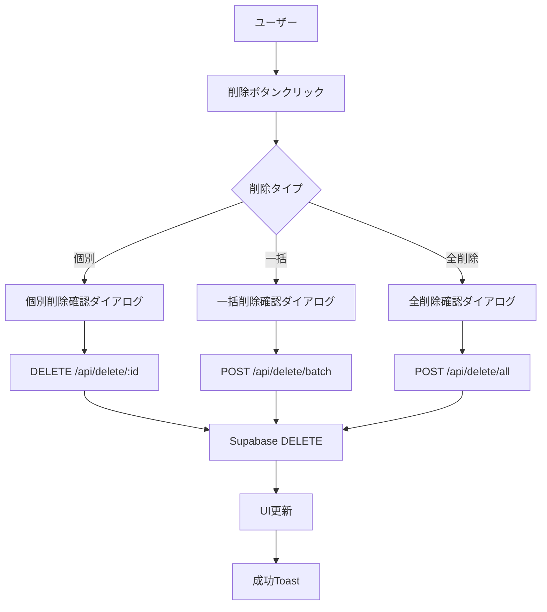
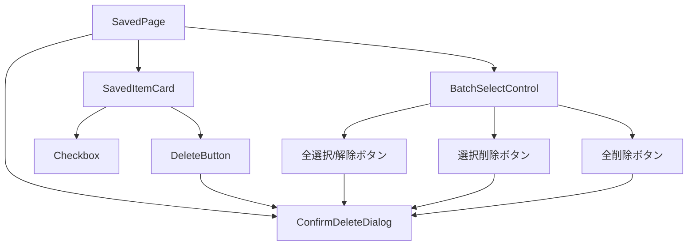
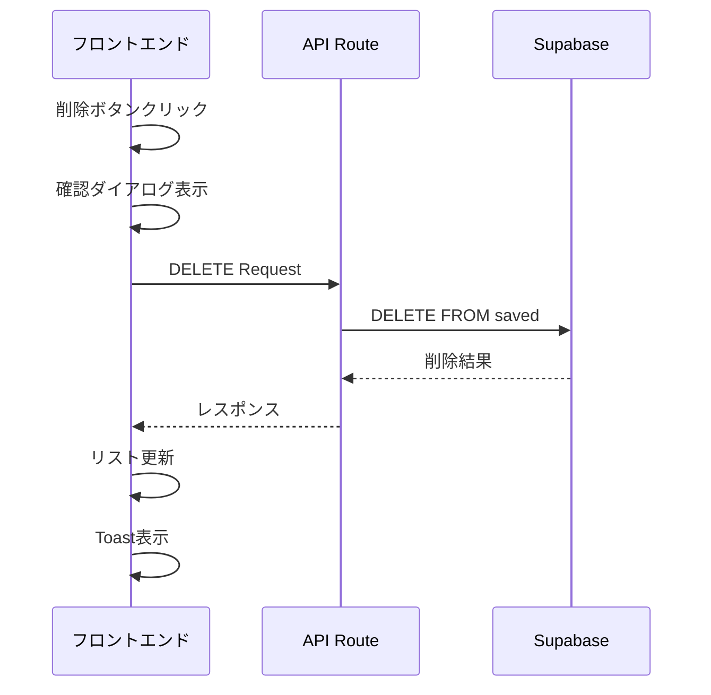

# saved-delete機能 設計書

**機能ID**: F-006-SAVED-DELETE
**作成日**: 2024-12-30
**更新日**: 2024-12-30
**作成者**: AI Assistant
**ステータス**: 設計中

---

## 1. 概要

保存済み記事(saved)の削除機能を実装する。個別削除・一括削除・全削除に対応し、誤削除を防ぐため確認ダイアログを必須とする。

### 1.1 目的
- 保存済み記事の効率的な削除機能を提供
- 誤削除防止のためのUI/UX改善
- 一括削除による利便性向上

### 1.2 対象ユーザー
- SwipeSummarizeを使用する全てのユーザー

---

## 2. 機能要件

### 2.1 基本機能

| 機能ID | 機能名 | 説明 | 優先度 |
|--------|--------|------|--------|
| F-006-01 | 個別削除 | 各保存済み記事を個別に削除 | 高 |
| F-006-02 | 一括削除 | 選択した複数記事を一括削除 | 高 |
| F-006-03 | 全削除 | 保存済み記事を全件削除 | 中 |
| F-006-04 | 削除確認 | 削除前の確認ダイアログ表示 | 高 |

### 2.2 詳細要件

#### F-006-01: 個別削除
- **操作**: 各カードの削除アイコンをクリック
- **確認**: 削除確認ダイアログを表示
- **実行**: ハードデリート（データベースから完全削除）

#### F-006-02: 一括削除
- **操作**: 複数選択モード + 削除ボタン
- **選択**: チェックボックスによる複数選択
- **確認**: 選択件数を含む削除確認ダイアログ
- **実行**: 選択されたアイテムを一括でハードデリート

#### F-006-03: 全削除
- **配置**: ページ上部に配置
- **確認**: 全件削除の強い警告ダイアログ
- **実行**: 全保存済み記事をハードデリート

#### F-006-04: 削除確認
- **必須**: 全ての削除操作で確認ダイアログを表示
- **内容**: 削除対象の詳細表示
- **選択肢**: キャンセル・削除の2択

---

## 3. 非機能要件

### 3.1 パフォーマンス
- 個別削除: 1秒以内
- 一括削除: 選択件数×100ms以内
- 全削除: 2秒以内

### 3.2 セキュリティ
- ユーザー権限に基づく削除制御
- CSRF対策実装

### 3.3 ユーザビリティ
- 削除後の自動リフレッシュ
- 削除完了通知（Toast）
- エラー時の適切なフィードバック

---

## 4. API設計

### 4.1 エンドポイント一覧

| Method | Path | 説明 | 認証 |
|--------|------|------|------|
| DELETE | `/api/delete/[id]` | 個別削除 | 不要 |
| POST | `/api/delete/batch` | 一括削除（RequestBody: ids配列） | 不要 |
| POST | `/api/delete/all` | 全削除 | 不要 |

### 4.2 API詳細仕様

#### 個別削除: DELETE `/api/delete/[id]`

**リクエスト**:
```
DELETE /api/delete/[id]
```

**レスポンス**:
```json
// 成功時 (200 OK) - 既存API形式に統一
{
  "deletedId": "uuid"
}

// エラー時 (404/500) - 既存API形式に統一
{
  "error": {
    "code": "NOT_FOUND",
    "message": "指定された記事が見つかりません"
  }
}
```

#### 一括削除: POST `/api/delete/batch`

**リクエスト**:
```json
{
  "ids": ["uuid1", "uuid2", "uuid3"]
}
```

**レスポンス**:
```json
// 成功時 (200 OK) - 既存API形式に統一
{
  "deletedCount": 3,
  "deletedIds": ["uuid1", "uuid2", "uuid3"]
}

// エラー時 (400/500) - 既存API形式に統一
{
  "error": {
    "code": "VALIDATION_ERROR",
    "message": "削除対象のIDが無効です"
  }
}
```

#### 全削除: POST `/api/delete/all`

**リクエスト**:
```json
{
  "confirm": true
}
```

**レスポンス**:
```json
// 成功時 (200 OK)
{
  "deletedCount": 42
}

// エラー時 (400) - 確認パラメータなし
{
  "error": {
    "code": "CONFIRMATION_REQUIRED",
    "message": "全削除には confirm: true が必要です"
  }
}
```

---

## 5. データベース設計

### 5.1 既存テーブル

```sql
-- 既存のsavedテーブル（変更なし）
CREATE TABLE saved (
  id UUID PRIMARY KEY DEFAULT gen_random_uuid(),
  title TEXT NOT NULL,
  summary TEXT NOT NULL,
  original_url TEXT NOT NULL,
  tags JSONB DEFAULT '[]'::jsonb,
  created_at TIMESTAMP WITH TIME ZONE DEFAULT NOW(),
  updated_at TIMESTAMP WITH TIME ZONE DEFAULT NOW()
);
```

### 5.2 削除操作

- **ハードデリート**: `DELETE FROM saved WHERE id = ?`
- **一括削除**: `DELETE FROM saved WHERE id = ANY(?)`
- **全削除**: `DELETE FROM saved`

---

## 6. フロントエンド設計

### 6.1 画面構成

#### 6.1.1 保存済みリスト画面の更新
```
┌─────────────────────────────────────┐
│ 保存済みリスト               [全削除] │
├─────────────────────────────────────┤
│ □ 記事タイトル1          [🗑️削除]    │
│   要約テキスト...                   │
│                                     │
│ □ 記事タイトル2          [🗑️削除]    │
│   要約テキスト...                   │
│                                     │
│ [n件選択中] [選択削除] [全選択/解除]  │
└─────────────────────────────────────┘
```

### 6.2 UIコンポーネント

#### 6.2.1 削除ボタン
```tsx
interface DeleteButtonProps {
  id: string;
  onDelete: (id: string) => void;
  disabled?: boolean;
}
```

#### 6.2.2 削除確認ダイアログ
```tsx
interface ConfirmDeleteDialogProps {
  open: boolean;
  onOpenChange: (open: boolean) => void;
  title: string;
  message: string;
  onConfirm: () => void;
  loading?: boolean;
}
```

#### 6.2.3 一括選択コントロール
```tsx
interface BatchSelectControlProps {
  selectedCount: number;
  totalCount: number;
  onSelectAll: () => void;
  onDeselectAll: () => void;
  onDeleteSelected: () => void;
}
```

### 6.3 状態管理

```typescript
interface SavedPageState {
  items: SavedItem[];
  selectedIds: string[];
  loading: boolean;
  deleteModalOpen: boolean;
  deleteTarget: {
    type: 'single' | 'batch' | 'all';
    ids?: string[];
    title?: string;
  } | null;
}

interface SavedPageActions {
  selectItem: (id: string) => void;
  deselectItem: (id: string) => void;
  selectAll: () => void;
  deselectAll: () => void;
  openDeleteModal: (target: DeleteTarget) => void;
  closeDeleteModal: () => void;
  executeDeletion: () => Promise<void>;
  refetchItems: () => Promise<void>;
}
```

---

## 7. エラーハンドリング

### 7.1 エラーシナリオ

| エラー | 原因 | 対処 |
|--------|------|------|
| 404 NOT_FOUND | 削除対象が存在しない | エラートースト表示 |
| 500 DATABASE_ERROR | DB削除エラー | エラートースト + リトライ提案 |
| 400 VALIDATION_ERROR | 不正なリクエスト | エラートースト表示 |
| NETWORK_ERROR | 通信エラー | エラートースト + リトライボタン |

### 7.2 ユーザーフィードバック

```typescript
// 成功時
toast.success("記事が削除されました");
toast.success(`${count}件の記事が削除されました`);

// エラー時
toast.error("削除に失敗しました。再度お試しください。");
toast.error("記事が見つかりませんでした。");
```

---

## 8. セキュリティ考慮事項

### 8.1 認証・認可
- 現在のシングルユーザー仕様に基づき特別な認証不要
- 将来的なマルチユーザー対応時は認証機能追加

### 8.2 入力検証
- UUIDフォーマット検証
- 空配列・null値のハンドリング
- SQLインジェクション対策（Supabaseクライアント使用）

### 8.3 レート制限
- 連続削除操作の制限（UI側で実装）
- API呼び出し頻度制限

---

## 9. テスト要件

### 9.1 単体テスト

#### API エンドポイント
- 正常系: 削除成功のテスト
- 異常系: 存在しないIDの削除
- 境界値: 空配列・大量データの一括削除

#### フロントエンド
- 削除ボタンのクリックイベント
- 削除確認ダイアログの表示・非表示
- 選択状態の管理

### 9.2 結合テスト
- API→DB削除の一連の流れ
- フロントエンド→API→DBの統合テスト
- エラー時のUI更新

### 9.3 E2Eテスト
- 個別削除の完全フロー
- 一括削除の完全フロー
- 全削除の完全フロー

---

## 10. 実装スケジュール

### Phase 1: API実装 (0.5日)
- [x] 個別削除API (`DELETE /api/saved/[id]`)
- [x] 一括削除API (`DELETE /api/saved/batch`)
- [x] 全削除API (`DELETE /api/saved/all`)

### Phase 2: UI実装 (1日)
- [x] 削除ボタンコンポーネント
- [x] 削除確認ダイアログ
- [x] 一括選択機能
- [x] 保存済みリスト画面の更新

### Phase 3: 統合・テスト (0.5日)
- [x] 統合テスト
- [x] エラーハンドリング確認
- [x] ユーザビリティテスト

---

## 11. 運用・監視

### 11.1 メトリクス
- 削除操作の実行回数
- 削除確認ダイアログのキャンセル率
- エラー発生率

### 11.2 ログ出力
```typescript
// 削除操作ログ
console.log(`[DELETE] saved item: ${id}, user: ${userId}`);
console.log(`[BATCH_DELETE] count: ${count}, user: ${userId}`);
console.log(`[ALL_DELETE] count: ${totalCount}, user: ${userId}`);
```

---

## 12. 将来拡張

### 12.1 拡張候補
- ソフトデリート機能
- 削除履歴・復元機能
- 削除理由の記録
- 削除権限の細分化

### 12.2 技術的改善
- 楽観的削除（Optimistic Updates）
- 削除アニメーション
- キーボードショートカット対応

---

## 12. アーキテクチャ図

### 12.1 データフロー図


### 12.2 コンポーネント関係図


### 12.3 API呼び出しシーケンス


---

## 付録

### A. 関連ファイル
- `/app/api/delete/[id]/route.ts` - 個別削除API（新規作成）
- `/app/api/delete/batch/route.ts` - 一括削除API（新規作成）
- `/app/api/delete/all/route.ts` - 全削除API（新規作成）
- `/app/saved/page.tsx` - 保存済みリスト画面（既存ファイル更新）
- `/components/saved/DeleteButton.tsx` - 削除ボタン（新規作成）
- `/components/saved/ConfirmDeleteDialog.tsx` - 削除確認ダイアログ（新規作成）
- `/components/saved/BatchSelectControl.tsx` - 一括選択コントロール（新規作成）

### B. 既存コードとの統合
- **エラーハンドリング**: 既存の `app/api/saved/route.ts` のエラー形式を踏襲
- **型定義**: 既存の `types/index.ts` の `SavedItem` 型を活用
- **UI パターン**: 既存のカードコンポーネントを拡張

### C. 参考資料
- [機能要件ドキュメント](../../functional_requirements.md) - F-003-URL-MANAGEMENT
- [既存API仕様](../../api/README.md)
- [データベーススキーマ](../../database-setup.md)