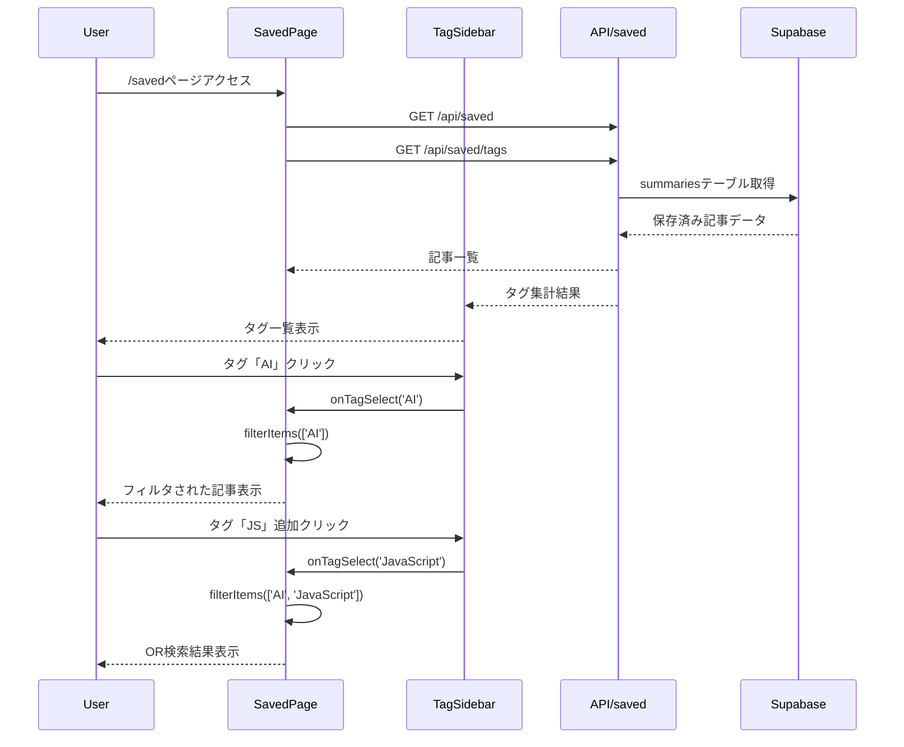

# saved-sidebar 設計書

| 項目 | 内容 |
| --- | --- |
| **Status** | Draft |
| **Owner** | Claude Code |
| **Ticket** | - |
| **Spec Path** | `docs/specs/saved-sidebar/` |
| **Last Updated** | 2025-01-01 |

> **AIアシスタントへの指示**:
> このドキュメントは「仕様駆動開発」のマスタードキュメントです。
> 各セクションは実装後に `/wrap-up` コマンドで `docs/` 以下の永続ドキュメントへ自動昇格されます。
> **整合性を重視**して記述してください。

> 📋 **参照ドキュメント**:
>
> - **コーディング規約**: [docs/development/coding-standards-index.md](../../docs/development/coding-standards-index.md) - 命名規則
> - **セキュリティ**: [docs/security/README.md](../../docs/security/README.md) - セキュリティ実装ガイドライン

---

## 1. 概要 (Overview)
**昇格先**: `docs/functional_requirements.md` に機能エントリ追加

### 1.1 機能ID
**F-007**: 保存済みページタグサイドバー機能

### 1.2 機能概要
保存済みページ（/saved）の左側にタグ一覧を表示するサイドバーを追加し、タグによる記事フィルタリング機能を提供する。タグは使用件数付きで名前順（あいうえお・アルファベット順）に表示し、複数選択でOR検索が可能。

### 1.3 ビジネス価値
- 保存済み記事が増加した際のタグによる効率的な記事探索
- 関連する記事をまとめて閲覧可能
- タグ使用頻度の可視化による情報整理の促進

### 1.4 ユーザーストーリー
- ユーザーとして、保存済み記事をタグで絞り込んで効率的に探したい
- ユーザーとして、どのタグがよく使われているかを一覧で把握したい
- ユーザーとして、複数のタグに関連する記事を一度に確認したい

### 1.5 受け入れ条件 (Acceptance Criteria)
1. WHEN ユーザーが保存済みページにアクセスする, THEN 左側にタグ一覧サイドバーが表示される
2. WHEN ユーザーがタグをクリックする, THEN 該当タグの記事のみが表示される
3. WHEN ユーザーが複数のタグを選択する, THEN OR検索で該当記事が表示される
4. IF タグが存在しない場合, THEN 「タグがありません」の状態表示

### 1.6 既存機能との関係
**参照**: `docs/functional_requirements.md`
- 関連機能: F-006 (Waiting List表示)
- 影響範囲: 保存済みページ（/saved）のレイアウト変更

---

## 2. API設計 (Backend)
**昇格先**: `docs/api/saved_apis.md` に追記

### 2.1 エンドポイント一覧
| Method | Path | Summary | Auth | 昇格対象 |
|--------|------|---------|------|---------|
| GET | `/api/saved/tags` | タグ一覧取得（使用件数付き） | 不要 | Yes |
| GET | `/api/saved?tags=tag1,tag2` | タグフィルタ付き保存済み記事取得 | 不要 | Yes |

### 2.2 詳細仕様

#### `GET /api/saved/tags`

**Description**: 保存済み記事で使用されているタグ一覧を使用件数付きで取得

**Request Parameters**: なし

**Security Headers**:
```typescript
// セキュリティヘッダーの設定
headers: {
  'Cache-Control': 'no-cache, no-store, must-revalidate',
  'Content-Security-Policy': "default-src 'self'",
  'X-Content-Type-Options': 'nosniff'
}
```

**Response** (200 OK):
```typescript
// Zodスキーマ定義
const TagSchema = z.object({
  tag: z.string().min(1).max(50).regex(/^[a-zA-Z0-9\u3040-\u309F\u30A0-\u30FF\u4E00-\u9FAF\s\-_]+$/, 'Invalid tag format'),
  count: z.number().int().positive()
});

const TagsResponseSchema = z.object({
  tags: z.array(TagSchema)
});

interface TagWithCount {
  tag: string;
  count: number;
}

interface TagsResponse {
  tags: TagWithCount[];
}
```

```json
{
  "tags": [
    {
      "tag": "AI",
      "count": 15
    },
    {
      "tag": "JavaScript",
      "count": 8
    },
    {
      "tag": "技術",
      "count": 12
    }
  ]
}
```

#### `GET /api/saved?tags=tag1,tag2`

**Description**: 既存の保存済み記事取得APIにタグフィルタ機能を追加

**Security Validation**:
```typescript
// 入力値検証スキーマ
const TagFilterSchema = z.object({
  tags: z
    .string()
    .optional()
    .transform((val) => val ? val.split(',') : [])
    .pipe(
      z.array(
        z.string()
          .min(1, 'Tag cannot be empty')
          .max(50, 'Tag too long')
          .regex(/^[a-zA-Z0-9\u3040-\u309F\u30A0-\u30FF\u4E00-\u9FAF\s\-_]+$/, 'Invalid tag characters')
      ).max(10, 'Too many tags')
    )
});
```

**Request Parameters**:
| 項目名 | 型 | 必須 | 制約ルール | 備考 |
|--------|-----|------|-----------|------|
| tags | string | - | カンマ区切り、1～50文字/タグ、最大10タグ | 日本語・英数字・ハイフン・アンダースコアのみ許可 |

**Response** (200 OK): 既存の `/api/saved` と同じフォーマット

**Error Responses**:
| Status | Error Code | Description | Format |
|--------|------------|-------------|---------|
| 400 | VALIDATION_ERROR | パラメータ検証エラー | 既存形式準拠 |
| 400 | INVALID_TAG_FORMAT | 不正なタグ形式 | 既存形式準拠 |
| 429 | RATE_LIMIT_EXCEEDED | レート制限超過 | 既存形式準拠 |
| 500 | INTERNAL_ERROR | サーバーエラー | 既存形式準拠 |

---

## 3. データモデル・バリデーション
**昇格先**: `docs/api/saved_apis.md` に含める

### 3.1 入力バリデーション（Zod準拠）

**既存API拡張スキーマ**:
```typescript
import { z } from 'zod';

// 既存のsaveSchemaに準拠したタグバリデーション
const TagValidationSchema = z.string()
  .min(1, 'タグが空です')
  .max(50, 'タグが長すぎます（50文字以内）')
  .regex(
    /^[a-zA-Z0-9\u3040-\u309F\u30A0-\u30FF\u4E00-\u9FAF\s\-_]+$/,
    '無効な文字が含まれています'
  );

// タグフィルタ用スキーマ
const TagFilterQuerySchema = z.object({
  tags: z
    .string()
    .optional()
    .transform((val) => val ? val.split(',').filter(Boolean) : [])
    .pipe(
      z.array(TagValidationSchema)
        .max(10, 'タグは最大10個まで')
    )
});
```

### 3.2 既存データモデル統一
**正確なテーブル構造**（既存コード準拠）:

```typescript
// 既存の`saved`テーブル構造を正確に反映
interface SavedRecord {
  id: string;
  title: string;
  summary: string;
  original_url: string;
  tags: string[];  // PostgreSQL配列型
  created_at: string;
  updated_at: string;
}

// 既存のZodスキーマと互換性維持
const savedRecordSchema = z.object({
  id: z.string().uuid(),
  title: z.string().min(1, "タイトルが必要です"),
  summary: z.string().min(1, "要約が必要です"),
  original_url: z.string().url("有効なURLが必要です"),
  tags: z.array(TagValidationSchema).default([]),
  created_at: z.string(),
  updated_at: z.string()
});
```

### 3.3 フロントエンド型定義

```typescript
// XSS防止のためのサニタイズ済みタグ型
interface SanitizedTag {
  tag: string;          // DOMPurify.sanitize済み
  count: number;
  isSelected: boolean;
}

interface TagsResponse {
  tags: Array<{
    tag: string;
    count: number;
  }>;
}

interface TagFilterState {
  selectedTags: string[];
  filteredItems: SavedRecord[];
  isLoading: boolean;
  error: string | null;
}

// エラーハンドリング型（既存パターン準拠）
interface ApiError {
  error: {
    code: string;
    message: string;
  };
}
```

### 3.4 セキュリティ制約

| 項目名 | 型 | 必須 | 制約ルール | セキュリティ対策 |
|--------|-----|------|-----------|-----------------|
| tags | string | - | カンマ区切り、1～50文字/タグ、最大10タグ | 正規表現検証、XSSサニタイゼーション |
| tag内容 | string | - | 日本語・英数字・ハイフン・アンダースコアのみ | SQLインジェクション防止 |
| APIレート | - | - | 1分間60リクエスト | DoS攻撃防止 |

---

## 4. ロジック・権限設計
**昇格先**: フロントエンド中心のため該当なし

### 4.1 認証・認可
* **認証**: 不要（既存の保存済みページと同様）
* **認可**: 不要

### 4.2 リソースアクセス制御
- 全ユーザーが全データを閲覧可能（現在は単一ユーザーアプリ）
- データは既存のSavedRecordと同一

### 4.3 セキュアなデータ処理ロジック

```typescript
import DOMPurify from 'dompurify';
import { TagValidationSchema } from './schemas';

// XSS防止付きタグフィルタリング
function filterItemsByTags(
  items: SavedRecord[],
  selectedTags: string[]
): SavedRecord[] {
  if (selectedTags.length === 0) return items;

  // 入力値をサニタイズ
  const sanitizedTags = selectedTags.map(tag =>
    DOMPurify.sanitize(tag.trim())
  ).filter(Boolean);

  return items.filter(item => {
    if (!item.tags || !Array.isArray(item.tags)) return false;

    return sanitizedTags.some(selectedTag =>
      item.tags.some(itemTag =>
        DOMPurify.sanitize(itemTag) === selectedTag
      )
    );
  });
}

// パフォーマンス最適化済みタグ集計
function aggregateTags(items: SavedRecord[]): TagWithCount[] {
  const tagCounts = new Map<string, number>();

  // メモリ効率化：大量データ対応
  for (const item of items) {
    if (!item.tags || !Array.isArray(item.tags)) continue;

    for (const rawTag of item.tags) {
      // サニタイゼーションとバリデーション
      const sanitizedTag = DOMPurify.sanitize(rawTag.trim());

      // Zodバリデーション
      const validationResult = TagValidationSchema.safeParse(sanitizedTag);
      if (!validationResult.success) continue;

      const tag = validationResult.data;
      tagCounts.set(tag, (tagCounts.get(tag) || 0) + 1);
    }
  }

  return Array.from(tagCounts.entries())
    .map(([tag, count]) => ({ tag, count }))
    .sort((a, b) => a.tag.localeCompare(b.tag, 'ja', {
      numeric: true,
      sensitivity: 'base'
    }));
}

// レート制限チェック
class RateLimiter {
  private requests = new Map<string, number[]>();

  isAllowed(clientId: string, limit: number = 60, window: number = 60000): boolean {
    const now = Date.now();
    const clientRequests = this.requests.get(clientId) || [];

    // 時間窓外のリクエストを削除
    const validRequests = clientRequests.filter(time => now - time < window);

    if (validRequests.length >= limit) {
      return false;
    }

    validRequests.push(now);
    this.requests.set(clientId, validRequests);
    return true;
  }
}
```

### 4.4 データベースクエリ最適化

```sql
-- パフォーマンス最適化されたタグ集計クエリ
-- 既存のsavedテーブルを使用（summariesテーブルではない）
SELECT
  unnest(tags) as tag,
  COUNT(*) as count
FROM saved
WHERE tags IS NOT NULL
  AND array_length(tags, 1) > 0
GROUP BY unnest(tags)
ORDER BY tag COLLATE "ja_JP.UTF-8";

-- フィルタリング用最適化クエリ（インデックス活用）
SELECT *
FROM saved
WHERE tags && $1::text[]  -- PostgreSQL配列オーバーラップ演算子
ORDER BY created_at DESC
LIMIT 100;

-- 必要なインデックス
CREATE INDEX CONCURRENTLY idx_saved_tags_gin
ON saved USING GIN(tags);
```

---

## 5. データベース設計
**昇格先**: 既存テーブル利用のため該当なし

### 5.1 新規テーブル
なし（既存のSupabase URLsテーブル、summariesテーブルを利用）

### 5.2 既存テーブル変更
なし

---

## 6. 状態遷移
**昇格先**: 該当なし（状態管理不要）

この機能では状態遷移は不要（単純なフィルタリング機能）

---

## 7. フロントエンド設計
**昇格先**: `docs/design/detailed_design/frontend/component_design.md` に追記

### 7.1 セキュアなコンポーネント構成

```
app/saved/page.tsx（既存、レイアウト調整）
├── components/saved/TagSidebar.tsx（新規、メインコンテナ）
│   ├── TagList.tsx（新規、仮想スクロール対応）
│   │   └── TagListItem.tsx（新規、XSS防止済み）
│   └── TagFilterControl.tsx（新規、状態管理）
└── hooks/useTagFilter.tsx（新規、ビジネスロジック分離）
```

#### TagSidebar.tsx
**パス**: `components/saved/TagSidebar.tsx`

```typescript
import { memo } from 'react';
import DOMPurify from 'dompurify';

interface TagSidebarProps {
  /** サニタイズ済みタグ一覧データ */
  tags: SanitizedTag[];
  /** 選択中のタグ（サニタイズ済み） */
  selectedTags: string[];
  /** タグ選択時のコールバック */
  onTagSelect: (tag: string) => void;
  /** タグ選択解除時のコールバック */
  onTagDeselect: (tag: string) => void;
  /** 全タグクリア時のコールバック */
  onClearAll: () => void;
  /** ローディング状態 */
  isLoading?: boolean;
  /** エラー状態 */
  error?: string | null;
  /** アクセシビリティ対応 */
  'aria-label'?: string;
}

// メモ化でパフォーマンス最適化
export const TagSidebar = memo<TagSidebarProps>(({
  tags,
  selectedTags,
  onTagSelect,
  onTagDeselect,
  onClearAll,
  isLoading = false,
  error = null,
  'aria-label': ariaLabel = "タグフィルター"
}) => {
  // セキュリティ: XSS防止のためのサニタイゼーション
  const sanitizedTags = tags.map(tag => ({
    ...tag,
    tag: DOMPurify.sanitize(tag.tag)
  }));

  return (
    <aside
      className="w-60 border-r bg-background"
      role="complementary"
      aria-label={ariaLabel}
    >
      {/* コンテンツ */}
    </aside>
  );
});
```

#### TagListItem.tsx
**パス**: `components/saved/TagListItem.tsx`

```typescript
import { memo, useCallback } from 'react';
import DOMPurify from 'dompurify';
import { Badge } from '@/components/ui/badge';
import { Button } from '@/components/ui/button';

interface TagListItemProps {
  /** サニタイズ済みタグ名 */
  tag: string;
  /** 使用件数 */
  count: number;
  /** 選択状態 */
  isSelected: boolean;
  /** クリック時のコールバック */
  onClick: () => void;
  /** 無効状態 */
  disabled?: boolean;
}

export const TagListItem = memo<TagListItemProps>(({
  tag,
  count,
  isSelected,
  onClick,
  disabled = false
}) => {
  // セキュリティ: 表示前の最終サニタイゼーション
  const sanitizedTag = DOMPurify.sanitize(tag);

  const handleClick = useCallback(() => {
    if (!disabled) onClick();
  }, [onClick, disabled]);

  return (
    <Button
      variant={isSelected ? "default" : "ghost"}
      size="sm"
      className="w-full justify-between h-auto p-2"
      onClick={handleClick}
      disabled={disabled}
      aria-pressed={isSelected}
      aria-label={`${sanitizedTag}タグ、${count}件の記事`}
    >
      <span className="truncate flex-1 text-left" title={sanitizedTag}>
        {sanitizedTag}
      </span>
      <Badge variant="secondary" className="ml-2 text-xs">
        {count}
      </Badge>
    </Button>
  );
});
```

### 7.2 カスタムフック（ビジネスロジック分離）

**パス**: `hooks/useTagFilter.tsx`

```typescript
import { useState, useCallback, useMemo } from 'react';
import { useQuery } from '@tanstack/react-query';
import DOMPurify from 'dompurify';

interface UseTagFilterReturn {
  tags: SanitizedTag[];
  selectedTags: string[];
  filteredItems: SavedRecord[];
  isLoading: boolean;
  error: string | null;
  selectTag: (tag: string) => void;
  deselectTag: (tag: string) => void;
  clearAllTags: () => void;
  refetch: () => void;
}

export function useTagFilter(savedItems: SavedRecord[]): UseTagFilterReturn {
  const [selectedTags, setSelectedTags] = useState<string[]>([]);

  // タグ一覧取得（React Query使用）
  const { data: tagsData, isLoading, error, refetch } = useQuery({
    queryKey: ['tags'],
    queryFn: async () => {
      const response = await fetch('/api/saved/tags');
      if (!response.ok) throw new Error('Failed to fetch tags');
      return response.json();
    },
    staleTime: 5 * 60 * 1000, // 5分間キャッシュ
    cacheTime: 10 * 60 * 1000, // 10分間保持
  });

  // セキュアなタグ選択処理
  const selectTag = useCallback((tag: string) => {
    const sanitizedTag = DOMPurify.sanitize(tag.trim());
    if (sanitizedTag && !selectedTags.includes(sanitizedTag)) {
      setSelectedTags(prev => [...prev, sanitizedTag]);
    }
  }, [selectedTags]);

  const deselectTag = useCallback((tag: string) => {
    const sanitizedTag = DOMPurify.sanitize(tag.trim());
    setSelectedTags(prev => prev.filter(t => t !== sanitizedTag));
  }, []);

  const clearAllTags = useCallback(() => {
    setSelectedTags([]);
  }, []);

  // パフォーマンス最適化：メモ化されたフィルタリング
  const filteredItems = useMemo(() => {
    return filterItemsByTags(savedItems, selectedTags);
  }, [savedItems, selectedTags]);

  // サニタイズ済みタグデータ
  const tags = useMemo(() => {
    if (!tagsData?.tags) return [];

    return tagsData.tags.map((tag: any) => ({
      tag: DOMPurify.sanitize(tag.tag),
      count: tag.count,
      isSelected: selectedTags.includes(DOMPurify.sanitize(tag.tag))
    }));
  }, [tagsData, selectedTags]);

  return {
    tags,
    selectedTags,
    filteredItems,
    isLoading,
    error: error?.message || null,
    selectTag,
    deselectTag,
    clearAllTags,
    refetch
  };
}
```

### 7.2 レイアウト構成

```
┌──────────────────────────────────────────────┐
│                   Header                      │
├────────────┬─────────────────────────────────┤
│ TagSidebar │         Main Content            │
│  (240px)   │                                 │
│            │  BatchSelectControl             │
│ ■ AI (15)  │  ┌─────────────────────────────┐ │
│ ■ JS (8)   │  │        Article Cards        │ │
│ □ React(3) │  │                             │ │
│ □ 技術(12) │  │                             │ │
│            │  └─────────────────────────────┘ │
│ [クリア]   │                                 │
│            │                                 │
└────────────┴─────────────────────────────────┘
```

### 7.3 状態管理
**React useState/useEffect**を使用:

```typescript
interface SavedPageState {
  savedItems: SavedRecord[];
  tags: TagWithCount[];
  selectedTags: string[];
  filteredItems: SavedRecord[];
  isLoading: boolean;
  isTagsLoading: boolean;
}
```

### 7.4 API呼び出し
**パス**: `app/api/saved/tags/route.ts`（新規作成）

```typescript
// Next.js API Route
export async function GET() {
  try {
    const supabase = await createClient();

    // 全保存済み記事を取得
    const { data: savedItems } = await supabase
      .from('summaries')
      .select('tags')
      .not('tags', 'is', null);

    // タグ集計
    const tagCounts = aggregateTags(savedItems);

    return NextResponse.json({ tags: tagCounts });
  } catch (error) {
    return NextResponse.json(
      { error: { code: 'INTERNAL_ERROR', message: 'タグ取得に失敗しました' } },
      { status: 500 }
    );
  }
}
```

---

## 8. エラーハンドリング
**昇格先**: フロントエンド中心のため該当なし

### 8.1 エラーシナリオ
| シナリオ | 対処 | ユーザー表示 |
|---------|------|------------|
| タグ取得API失敗 | サイドバーを非表示/リトライボタン表示 | 「タグの読み込みに失敗しました」 |
| フィルタリング後0件 | 空状態UI表示 | 「選択したタグの記事はありません」 |
| 大量タグ表示 | 仮想スクロール/ページネーション | 正常表示 |

---

## 9. テストケース
**昇格先**: `docs/testing/saved/` に追記

### 9.1 ユースケース & テストシナリオ

| ID | シナリオ概要 | アクター | 前提条件 | 操作手順 / 入力データ | 期待される挙動 / レスポンス | 検証すべき副作用 |
|----|------------|---------|---------|---------------------|---------------------------|-----------------|
| UC-01 | [正常系] サイドバー初期表示 | User | 保存済み記事あり | 1. /savedページアクセス | ・左側にタグ一覧表示<br>・使用件数付きで表示<br>・名前順ソート | なし |
| UC-02 | [正常系] 単一タグ選択 | User | タグ一覧表示中 | 1. 「AI」タグをクリック | ・AIタグがハイライト<br>・AIタグの記事のみ表示 | なし |
| UC-03 | [正常系] 複数タグ選択（OR検索） | User | 単一タグ選択済み | 1. 追加で「JavaScript」タグをクリック | ・両タグがハイライト<br>・AIまたはJavaScriptタグの記事表示 | なし |
| UC-04 | [正常系] タグ選択解除 | User | 複数タグ選択済み | 1. 選択済みタグをクリック | ・該当タグのハイライト解除<br>・残りタグの記事のみ表示 | なし |
| UC-05 | [正常系] 全クリア機能 | User | 複数タグ選択済み | 1. 「クリア」ボタンクリック | ・全タグ選択解除<br>・全記事表示に戻る | なし |
| UC-06 | [正常系] 空状態表示 | User | フィルタ結果0件 | 1. 該当記事なしタグを選択 | ・「選択したタグの記事はありません」表示 | なし |
| UC-07 | [異常系] タグAPI取得失敗 | User | - | 1. ページアクセス時API失敗 | ・エラーメッセージ表示<br>・リトライボタン表示 | なし |
| UC-08 | [境界値] タグなし状態 | User | 保存済み記事にタグなし | 1. ページアクセス | ・「タグがありません」表示 | なし |
| UC-09 | [正常系] レスポンシブ非対応確認 | User | デスクトップ表示 | 1. ウィンドウサイズを小さく | ・サイドバーは固定幅維持<br>・モバイルでは機能無効 | なし |

### 9.2 テストファイル
- Component: `components/saved/__tests__/TagSidebar.test.tsx`
- API: `app/api/saved/tags/__tests__/route.test.ts`
- Integration: `__tests__/saved-page-with-tags.test.tsx`

---

## 10. 複雑なフロー詳細 (Optional)

### 10.1 タグフィルタリングフロー

```typescript
// 複数タグ選択時のフィルタリングフロー
1. 初期状態: 全記事表示
   selectedTags = []
   filteredItems = allItems

2. タグ選択: 「AI」クリック
   selectedTags = ['AI']
   filteredItems = items.filter(item => item.tags.includes('AI'))

3. 追加選択: 「JavaScript」クリック
   selectedTags = ['AI', 'JavaScript']
   filteredItems = items.filter(item =>
     item.tags.includes('AI') || item.tags.includes('JavaScript')
   )

4. 選択解除: 「AI」再クリック
   selectedTags = ['JavaScript']
   filteredItems = items.filter(item => item.tags.includes('JavaScript'))

5. 全クリア: クリアボタンクリック
   selectedTags = []
   filteredItems = allItems
```

### 10.2 タグソート・表示ロジック

```typescript
// 日本語・英語混在タグのソート
function sortTags(tags: TagWithCount[]): TagWithCount[] {
  return tags.sort((a, b) => {
    // 日本語・英語を考慮したlocaleCompare
    return a.tag.localeCompare(b.tag, 'ja', {
      sensitivity: 'base',
      numeric: true
    });
  });
}

// 例: ['AI', 'JavaScript', 'あいうえお', '技術', 'React']
// → ['AI', 'JavaScript', 'React', 'あいうえお', '技術']
```

---

## 11. シーケンス図 (Optional)



---

## 12. 実装メモ (Implementation Notes)

### 12.1 決定事項
- 2025-01-01: モバイル対応は今回見送り、デスクトップのみ対応
- サイドバー幅: 240px固定
- タグソート: 日本語・英語混在を考慮したlocaleCompare使用

### 12.2 注意点
- 既存の保存済みページレイアウトとの調和を重視
- タグデータの取得は保存済み記事と同時に行い、パフォーマンス最適化
- タグ名の表示は最大20文字で切り詰め（...）

### 12.3 今後の課題 (Future Work)
- モバイル対応（ドロワー形式での表示）
- タグ検索機能（多数のタグがある場合）
- タグの階層化・グループ化

### 12.4 完了タスク
- [ ] T-01: TagSidebar コンポーネント作成
- [ ] T-02: タグ集計API実装
- [ ] T-03: フィルタリング機能実装
- [ ] T-04: 既存ページレイアウト調整

---

## 13. 昇格チェックリスト (Promotion Checklist)

### 必須項目
- [ ] **機能要件** → `docs/functional_requirements.md`
  - 機能ID: F-007
  - 機能名: 保存済みページタグサイドバー機能
  - 実装状況: ✅ 実装済み

- [ ] **API仕様** → `docs/api/saved_apis.md`
  - エンドポイント数: 2件（新規1件、既存1件拡張）
  - フォーマット: 既存API仕様書形式に準拠

- [ ] **API一覧更新** → `docs/api/README.md`
  - エンドポイント総数更新
  - 新規APIへのリンク追加

### 条件付き項目 (該当する場合のみ)
- [ ] **フロントエンド** → `docs/design/detailed_design/frontend/component_design.md`
  - 新規コンポーネント: TagSidebar, TagList, TagListItem

### 検証項目
- [ ] 全テストがパス
- [ ] デスクトップブラウザでの動作確認
- [ ] 既存機能への影響なし確認

---

## 変更履歴

| 日付 | バージョン | 変更内容 | 担当者 |
|------|----------|---------|--------|
| 2025-01-01 | 0.1.0 | 初版作成 | Claude Code |