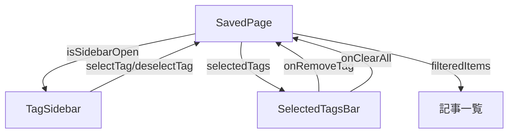

# tag-slidebar-update 設計書

## 1. 概要

### 1.1 機能概要

タグサイドバーの表示/非表示を切り替えるトグル機能と、選択中のタグをヘッダー下にバッジ表示する機能を追加する。

### 1.2 ユーザーストーリー

- ユーザーとして、サイドバーを非表示にして記事一覧を広く表示したい
- ユーザーとして、サイドバーを閉じても選択中のタグを確認・解除したい

### 1.3 スコープ

| 項目 | 内容 |
|------|------|
| 対象画面 | `/saved` ページ |
| 対象デバイス | デスクトップのみ（lg以上） |
| 認証 | 不要 |

---

## 2. UI設計

### 2.1 変更箇所

```
┌─────────────────────────────────────────────────────────────┐
│ ヘッダー                                    [サイドバー開閉] │
├─────────────────────────────────────────────────────────────┤
│ 選択中タグ: [React ×] [TypeScript ×] [クリア]               │ ← 新規追加
├──────────┬──────────────────────────────────────────────────┤
│ サイドバー│ メインコンテンツ                                  │
│ (トグル) │                                                  │
│          │                                                  │
└──────────┴──────────────────────────────────────────────────┘
```

### 2.2 新規コンポーネント

#### SelectedTagsBar

選択中タグをバッジとして表示するコンポーネント

```tsx
interface SelectedTagsBarProps {
  selectedTags: string[];
  onRemoveTag: (tag: string) => void;
  onClearAll: () => void;
}
```

**表示条件**: `selectedTags.length > 0` の場合のみ表示

### 2.3 変更コンポーネント

#### SavedPage (`app/saved/page.tsx`)

| 変更内容 | 詳細 |
|---------|------|
| 状態追加 | `isSidebarOpen: boolean` (デフォルト: `true`) |
| トグルボタン | ヘッダーにサイドバー開閉ボタンを追加 |
| SelectedTagsBar | ヘッダー下に選択中タグバーを追加 |
| useTagFilter展開 | ページレベルでフック使用に変更 |

#### TagSidebar (`components/saved/TagSidebar.tsx`)

| 変更内容 | 詳細 |
|---------|------|
| Props追加 | `selectedTags`, `onSelectTag`, `onDeselectTag` を外部から受け取る |
| 内部状態削除 | useTagFilter をページに移動 |

---

## 3. 状態管理設計

### 3.1 状態の持ち方

```tsx
// app/saved/page.tsx
const [isSidebarOpen, setIsSidebarOpen] = useState(true);

// useTagFilter をページレベルで使用
const {
  tags,
  selectedTags,
  filteredItems,
  isLoading,
  error,
  selectTag,
  deselectTag,
  clearAllTags
} = useTagFilter(savedItems);
```

### 3.2 状態フロー



---

## 4. コンポーネント詳細設計

### 4.1 SelectedTagsBar

**ファイル**: `components/saved/SelectedTagsBar.tsx`

```tsx
interface SelectedTagsBarProps {
  selectedTags: string[];
  onRemoveTag: (tag: string) => void;
  onClearAll: () => void;
}
```

**UI仕様**:
- 選択中タグをBadgeで表示
- 各Badgeに×ボタン（クリックで解除）
- 右端に「クリア」ボタン（全解除）
- タグがない場合は非表示

**オーバーフロー対策**:
- `flex-wrap` で複数行に折り返し
- `max-h-24 overflow-y-auto` で最大高さ制限（4行程度）
- 10タグ以上の場合はスクロール表示

**アクセシビリティ**:
- `role="region"` + `aria-label="選択中のタグ"`
- `aria-live="polite"` でスクリーンリーダーに変更通知
- 各×ボタン: `aria-label="{tag}を解除"`

**スタイル**:
- 背景: `bg-muted/50`
- パディング: `px-4 py-2`
- Badge: `variant="secondary"` + ×アイコン

### 4.2 サイドバートグルボタン

**配置**: ヘッダー右側（「ホームに戻る」ボタンの左）

**UI仕様**:
- アイコン: `PanelLeftClose` (開いている時) / `PanelLeft` (閉じている時)
- ツールチップ: 「サイドバーを閉じる」/「サイドバーを開く」

**アクセシビリティ**:
- `aria-expanded={isSidebarOpen}`
- `aria-controls="tag-sidebar"`
- `aria-label="タグサイドバーを{isSidebarOpen ? '閉じる' : '開く'}"`

**連打対策**:
- アニメーション中は `pointer-events-none` を適用
- `transition-all duration-300` 完了後に再度クリック可能

---

## 5. 実装タスク

### T-01: SelectedTagsBar コンポーネント作成

**ファイル**: `components/saved/SelectedTagsBar.tsx`

**実装内容**:
- Props: `selectedTags`, `onRemoveTag`, `onClearAll`
- Badge + X ボタンでタグ表示
- クリアボタン

### T-02: SavedPage にサイドバートグル追加

**ファイル**: `app/saved/page.tsx`

**実装内容**:
1. `isSidebarOpen` 状態追加
2. トグルボタンをヘッダーに追加
3. サイドバーの表示/非表示を条件分岐
4. `useTagFilter` をページレベルに移動

### T-03: TagSidebar のリファクタリング

**ファイル**: `components/saved/TagSidebar.tsx`

**実装内容**:
- Props を外部から受け取る形式に変更
- 内部の `useTagFilter` 呼び出しを削除

### T-04: SelectedTagsBar を SavedPage に統合

**ファイル**: `app/saved/page.tsx`

**実装内容**:
- SelectedTagsBar をヘッダー下に配置
- `selectedTags`, `deselectTag`, `clearAllTags` を渡す

---

## 6. テストケース

| ID | シナリオ | 操作 | 期待結果 |
|----|---------|------|---------|
| TC-01 | サイドバーを閉じる | トグルボタンをクリック | サイドバーが非表示になる |
| TC-02 | サイドバーを開く | トグルボタンをクリック | サイドバーが表示される |
| TC-03 | 選択中タグの表示 | タグを選択 | ヘッダー下にバッジ表示 |
| TC-04 | タグ個別解除 | バッジの×をクリック | そのタグのみ解除 |
| TC-05 | 全タグクリア | クリアボタンをクリック | 全タグ解除、バー非表示 |
| TC-06 | サイドバー閉じてもタグ維持 | サイドバー閉じる | 選択中タグは維持される |

---

## 7. 実装メモ

### 注意点

1. `useTagFilter` の移動により、TagSidebar と SelectedTagsBar で同じ状態を共有
2. サイドバーの開閉状態は localStorage に保存しない（ページ遷移でリセット）
3. アニメーションは `transition-all duration-300` で統一

### 依存関係

- lucide-react: `PanelLeft`, `PanelLeftClose`, `X` アイコン
- shadcn/ui: `Button`, `Badge`

---

## 8. 昇格チェックリスト

| セクション | 昇格先 | 該当 |
|-----------|--------|------|
| API設計 | docs/api/ | ❌ なし |
| DB設計 | docs/database/ | ❌ なし |
| UI設計 | docs/design/frontend/ | ✅ 昇格可 |
| テストケース | docs/testing/ | ✅ 昇格可 |
